# 更有区分度的两题：原文与真实渲染

每组两份输出；源回答未改写。PNG最长边统一限制1600像素，SVG可放大查看。语法与布局结论分开，见[报告](README.md)。

## 选图、拆图与约束表达

### show-me

[原始回答](outputs/show-me/01-mixed.md) · [完整模型输入](model-inputs/show-me/01-mixed.txt)

图 1： [SVG](rendered/show-me--01-mixed--1.svg) · [PNG原图](rendered/show-me--01-mixed--1.png)

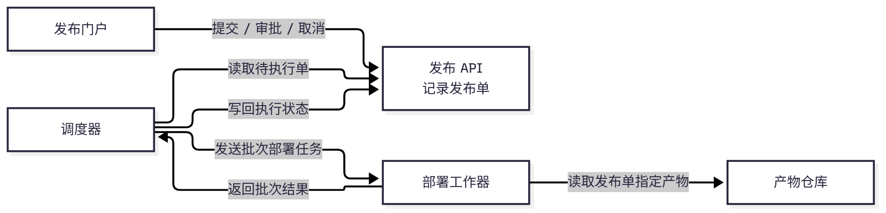

图 2： [SVG](rendered/show-me--01-mixed--2.svg) · [PNG原图](rendered/show-me--01-mixed--2.png)

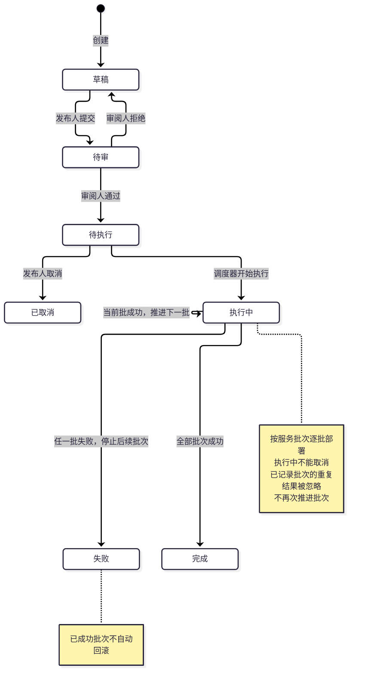

展开未改写的模型回答

### 各部分怎样协作

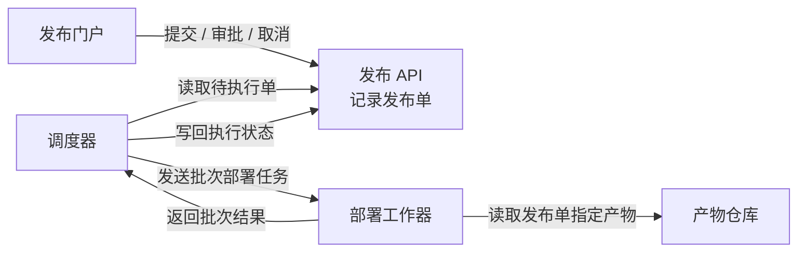
```mermaid
flowchart LR
    P["发布门户"] -->|"提交 / 审批 / 取消"| A["发布 API<br/>记录发布单"]
    S["调度器"] -->|"读取待执行单"| A
    S -->|"写回执行状态"| A
    S -->|"发送批次部署任务"| W["部署工作器"]
    W -->|"返回批次结果"| S
    W -->|"读取发布单指定产物"| R["产物仓库"]
```

每张发布单**仅关联一个不可变构建产物**；同一产物可供多张发布单使用。调度器根据工作器返回的结果更新发布状态。

### 发布状态与异常

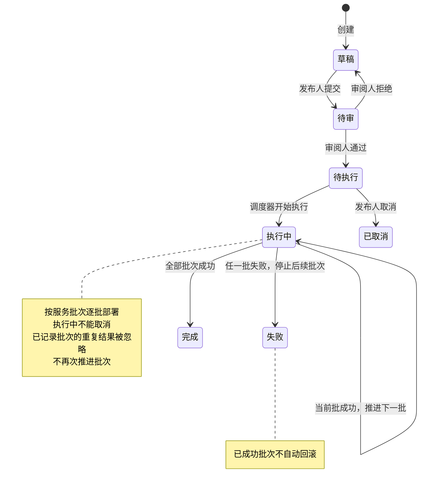
```mermaid
stateDiagram-v2
    state "草稿" as Draft
    state "待审" as Review
    state "待执行" as Ready
    state "执行中" as Running
    state "已取消" as Cancelled
    state "失败" as Failed
    state "完成" as Done

    [*] --> Draft: 创建
    Draft --> Review: 发布人提交
    Review --> Draft: 审阅人拒绝
    Review --> Ready: 审阅人通过
    Ready --> Cancelled: 发布人取消
    Ready --> Running: 调度器开始执行
    Running --> Running: 当前批成功，推进下一批
    Running --> Failed: 任一批失败，停止后续批次
    Running --> Done: 全部批次成功

    note right of Running
        按服务批次逐批部署
        执行中不能取消
        已记录批次的重复结果被忽略
        不再次推进批次
    end note
    note right of Failed
        已成功批次不自动回滚
    end note
```

调度器**只执行待执行单**，先将其置为执行中，再派发批次任务。只有当前批成功，才推进下一批。

### 审批与执行的权限边界

| 操作者 | 允许的动作 | 约束落点 |
|---|---|---|
| 发布人 | 提交、取消 | 提交：草稿 → 待审；取消：仅待执行时 |
| 审阅人 | 审批通过、拒绝 | 仅待审时；**不能审批自己提交的同一张单** |
| 调度器 | 推进执行状态 | 待执行 → 执行中；依据批次结果推进至失败或完成 |

一个人可以同时拥有发布人和审阅人角色，但审批时仍须检查**该单的提交人身份**。这些约束应在发布 API 接受操作、记录状态变更的边界生效；门户提供操作入口。调度器负责执行状态推进和批次结果去重。

以上仅展示已确认体系；数据库、消息队列、通知、超时、自动重试及失败后恢复方案均未提供。

### mermaid-diagrams

[原始回答](outputs/mermaid-diagrams/01-mixed.md) · [完整模型输入](model-inputs/mermaid-diagrams/01-mixed.txt)

图 1： [SVG](rendered/mermaid-diagrams--01-mixed--1.svg) · [PNG原图](rendered/mermaid-diagrams--01-mixed--1.png)

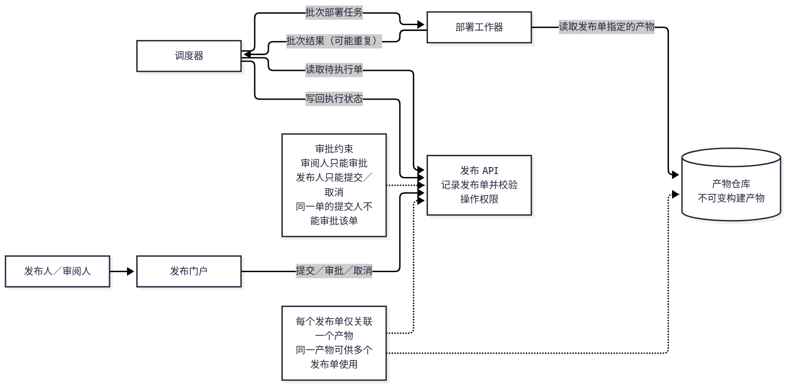

图 2： [SVG](rendered/mermaid-diagrams--01-mixed--2.svg) · [PNG原图](rendered/mermaid-diagrams--01-mixed--2.png)

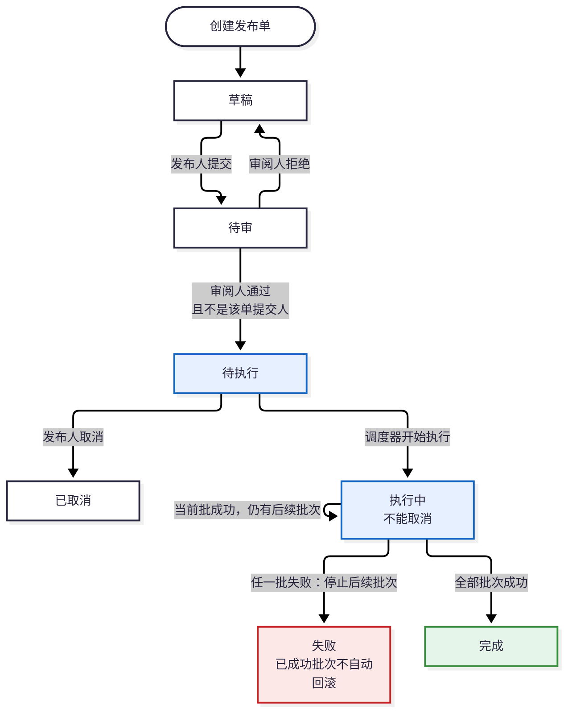

图 3： [SVG](rendered/mermaid-diagrams--01-mixed--3.svg) · [PNG原图](rendered/mermaid-diagrams--01-mixed--3.png)

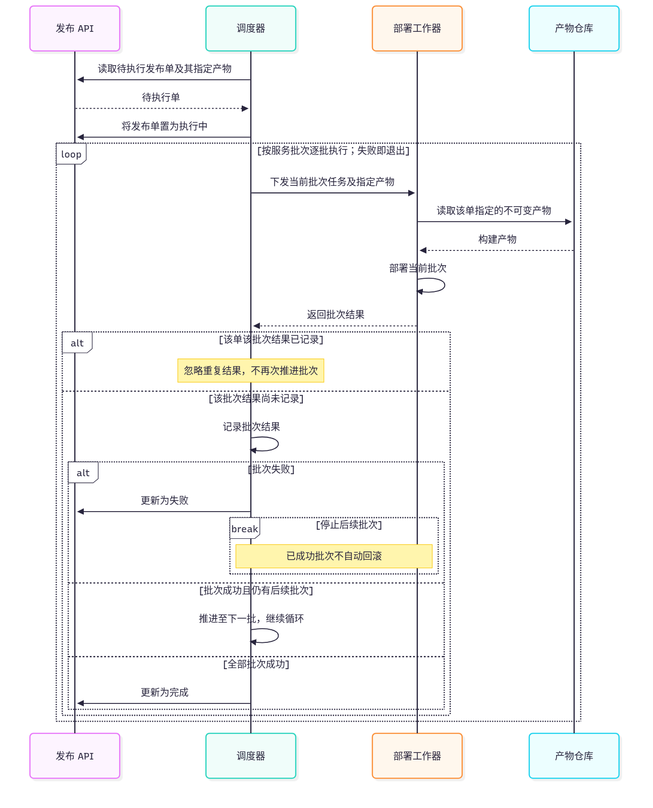

展开未改写的模型回答

下面三个视图分别说明组件协作、状态变化和批次执行。

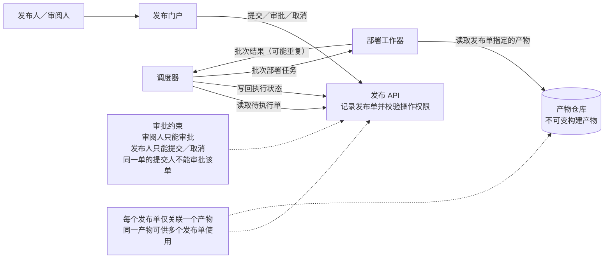
```mermaid
flowchart LR
    U["发布人／审阅人"] --> P["发布门户"]
    P -->|"提交／审批／取消"| A["发布 API<br/>记录发布单并校验操作权限"]
    S["调度器"] -->|"读取待执行单"| A
    S -->|"写回执行状态"| A
    S -->|"批次部署任务"| W["部署工作器"]
    W -->|"批次结果（可能重复）"| S
    W -->|"读取发布单指定的产物"| R[("产物仓库<br/>不可变构建产物")]

    C["审批约束<br/>审阅人只能审批<br/>发布人只能提交／取消<br/>同一单的提交人不能审批该单"]
    C -.-> A

    B["每个发布单仅关联一个产物<br/>同一产物可供多个发布单使用"]
    B -.-> A
    B -.-> R
```

一个人可以同时拥有发布人和审阅人角色，但审批时仍须检查其是否为该单提交人；拥有审阅人角色不能绕过这条约束。

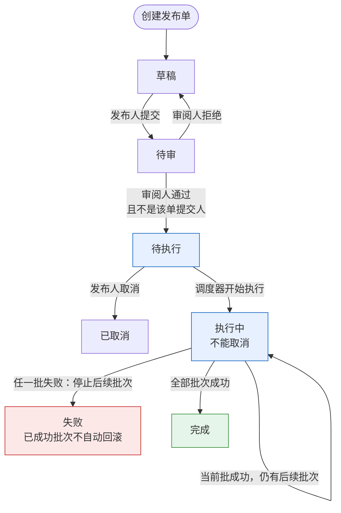
```mermaid
flowchart TD
    N([创建发布单]) --> D["草稿"]
    D -->|"发布人提交"| R["待审"]
    R -->|"审阅人拒绝"| D
    R -->|"审阅人通过<br/>且不是该单提交人"| Q["待执行"]
    Q -->|"发布人取消"| C["已取消"]
    Q -->|"调度器开始执行"| E["执行中<br/>不能取消"]
    E -->|"当前批成功，仍有后续批次"| E
    E -->|"任一批失败：停止后续批次"| F["失败<br/>已成功批次不自动回滚"]
    E -->|"全部批次成功"| S["完成"]

    classDef success fill:#e5f5e9,stroke:#388e3c
    classDef failure fill:#fde8e8,stroke:#c62828
    classDef active fill:#e6f0ff,stroke:#1565c0
    class S success
    class F failure
    class Q,E active
```

审批和提交／取消分别受角色限制；进入执行中以及后续执行状态的推进仅由调度器负责。

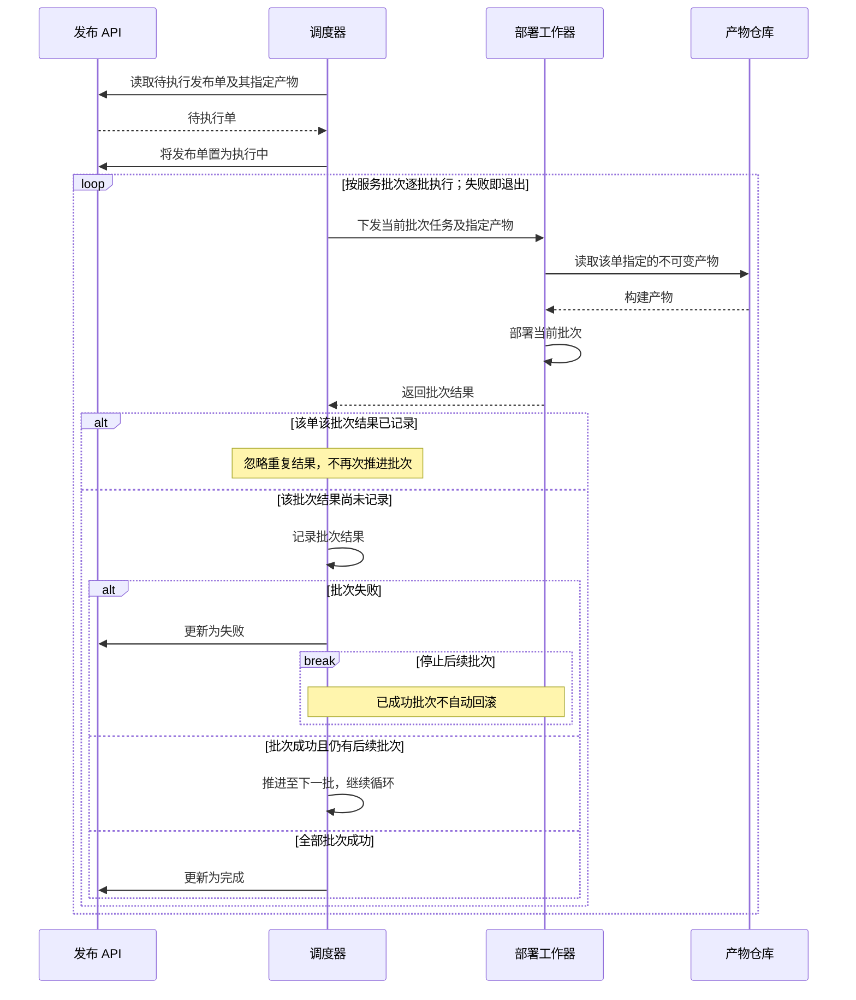
```mermaid
sequenceDiagram
    participant API as 发布 API
    participant S as 调度器
    participant W as 部署工作器
    participant R as 产物仓库

    S->>API: 读取待执行发布单及其指定产物
    API-->>S: 待执行单
    S->>API: 将发布单置为执行中

    loop 按服务批次逐批执行；失败即退出
        S->>W: 下发当前批次任务及指定产物
        W->>R: 读取该单指定的不可变产物
        R-->>W: 构建产物
        W->>W: 部署当前批次
        W-->>S: 返回批次结果

        alt 该单该批次结果已记录
            Note over S: 忽略重复结果，不再次推进批次
        else 该批次结果尚未记录
            S->>S: 记录批次结果
            alt 批次失败
                S->>API: 更新为失败
                break 停止后续批次
                    Note over S,W: 已成功批次不自动回滚
                end
            else 批次成功且仍有后续批次
                S->>S: 推进至下一批，继续循环
            else 全部批次成功
                S->>API: 更新为完成
            end
        end
    end
```

批次去重的范围是“同一发布单、同一批次”。以上未补入数据库、消息队列、通知、超时、自动重试或失败后恢复机制；这些方案尚未提供。

### visual-v041

[原始回答](outputs/visual-v041/01-mixed.md) · [完整模型输入](model-inputs/visual-v041/01-mixed.txt)

图 1： [SVG](rendered/visual-v041--01-mixed--1.svg) · [PNG原图](rendered/visual-v041--01-mixed--1.png)

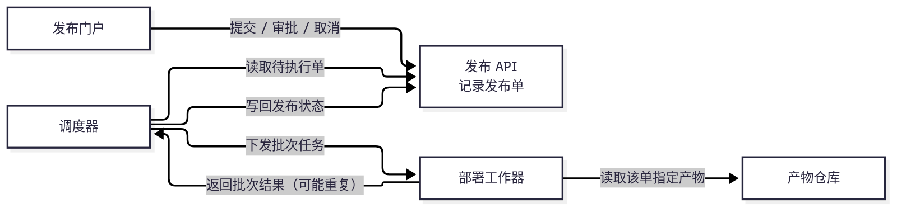

图 2： [SVG](rendered/visual-v041--01-mixed--2.svg) · [PNG原图](rendered/visual-v041--01-mixed--2.png)

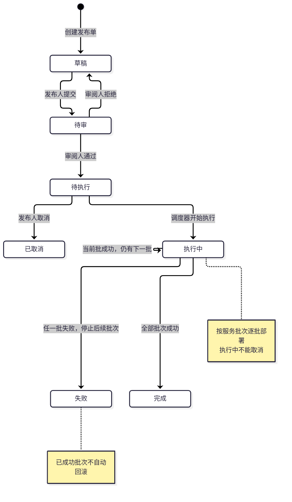

图 3： [SVG](rendered/visual-v041--01-mixed--3.svg) · [PNG原图](rendered/visual-v041--01-mixed--3.png)

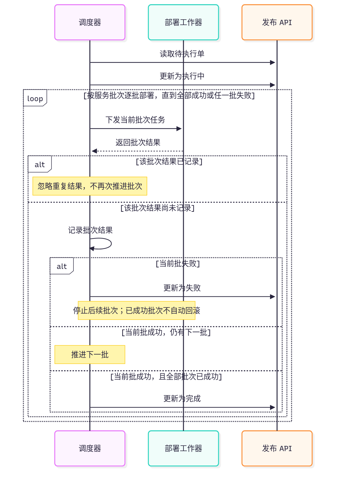

展开未改写的模型回答

**协作关系：发布单绑定产物，调度器组织部署，工作器执行批次。**

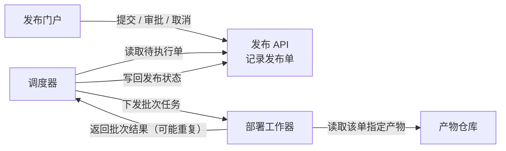
```mermaid
flowchart LR
    P["发布门户"] -->|"提交 / 审批 / 取消"| A["发布 API<br/>记录发布单"]
    S["调度器"] -->|"读取待执行单"| A
    S -->|"写回发布状态"| A
    S -->|"下发批次任务"| W["部署工作器"]
    W -->|"返回批次结果（可能重复）"| S
    W -->|"读取该单指定产物"| R["产物仓库"]
```

每张发布单**关联且仅关联一个不可变构建产物**；同一产物可以被多张发布单使用。

**状态演变：先审批，再执行；失败保留已经成功的部署。**

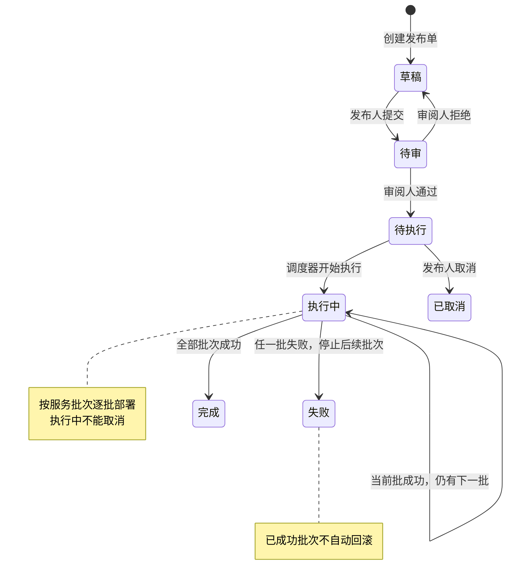
```mermaid
stateDiagram-v2
    state "草稿" as Draft
    state "待审" as Review
    state "待执行" as Ready
    state "执行中" as Running
    state "已取消" as Cancelled
    state "失败" as Failed
    state "完成" as Done

    [*] --> Draft: 创建发布单
    Draft --> Review: 发布人提交
    Review --> Draft: 审阅人拒绝
    Review --> Ready: 审阅人通过
    Ready --> Cancelled: 发布人取消
    Ready --> Running: 调度器开始执行
    Running --> Running: 当前批成功，仍有下一批
    Running --> Failed: 任一批失败，停止后续批次
    Running --> Done: 全部批次成功

    note right of Running
        按服务批次逐批部署
        执行中不能取消
    end note
    note right of Failed
        已成功批次不自动回滚
    end note
```

**批次推进：每批成功才继续，同一批结果只处理一次。**

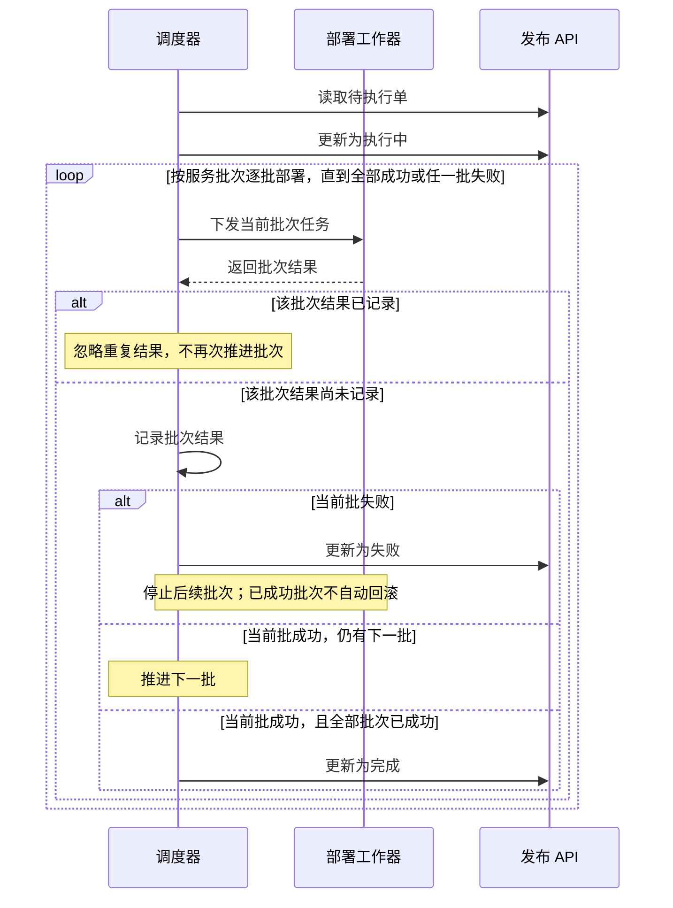
```mermaid
sequenceDiagram
    participant S as 调度器
    participant W as 部署工作器
    participant A as 发布 API

    S->>A: 读取待执行单
    S->>A: 更新为执行中

    loop 按服务批次逐批部署，直到全部成功或任一批失败
        S->>W: 下发当前批次任务
        W-->>S: 返回批次结果
        alt 该批次结果已记录
            Note over S: 忽略重复结果，不再次推进批次
        else 该批次结果尚未记录
            S->>S: 记录批次结果
            alt 当前批失败
                S->>A: 更新为失败
                Note over S,W: 停止后续批次；已成功批次不自动回滚
            else 当前批成功，仍有下一批
                Note over S: 推进下一批
            else 当前批成功，且全部批次已成功
                S->>A: 更新为完成
            end
        end
    end
```

**审批约束针对具体发布单，拥有双角色也不能自审。**

| 主体 | 允许的操作 | 关键约束 |
|---|---|---|
| 发布人 | 提交、取消 | 仅待执行可取消；执行中不能取消 |
| 审阅人 | 审批（通过或拒绝） | 不能审批自己提交的同一张单 |
| 调度器 | 推进执行状态 | 只执行待执行单，根据批次结果推进 |

一个人可以同时拥有发布人和审阅人角色，但**该单提交人与审批人必须不同**。这些约束适用于门户向 API 发起的发布单操作；材料未指定具体权限校验实现位置。

图中未补入数据库、消息队列、通知、超时、自动重试或失败后恢复机制。以上为可编辑 Mermaid 源码，未进行工具语法检查或实际渲染。

## C4层级、组织边界与复杂通信

### show-me

[原始回答](outputs/show-me/02-c4.md) · [完整模型输入](model-inputs/show-me/02-c4.txt)

图 1： [SVG](rendered/show-me--02-c4--1.svg) · [PNG原图](rendered/show-me--02-c4--1.png)

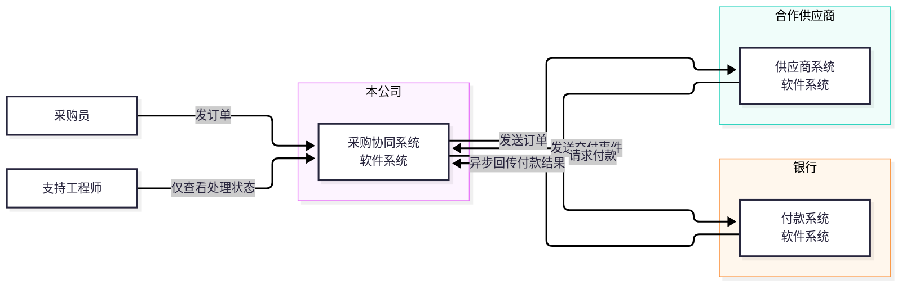

图 2： [SVG](rendered/show-me--02-c4--2.svg) · [PNG原图](rendered/show-me--02-c4--2.png)

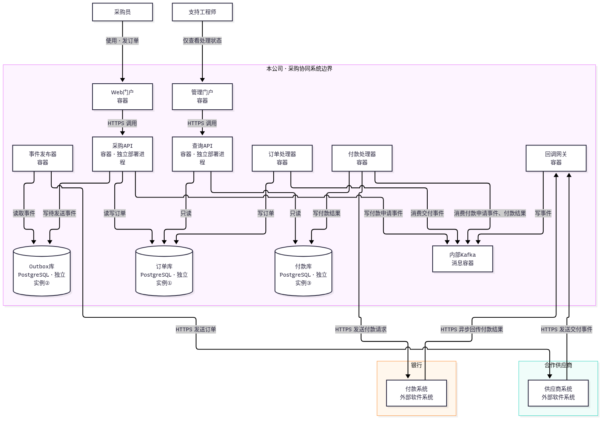

展开未改写的模型回答

### C4 一级：系统上下文——组织与系统边界

供业务负责人查看：三个系统分别归属本公司、合作供应商与银行；跨组织通信以系统为单位展示。

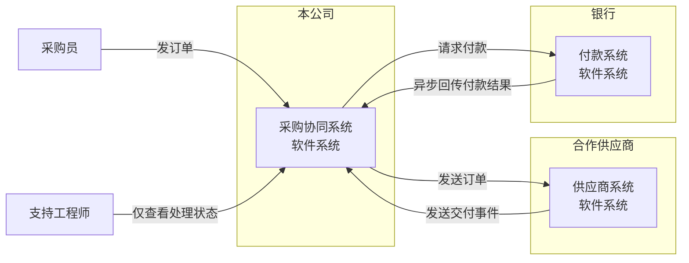
```mermaid
flowchart LR
    buyer["采购员"]
    support["支持工程师"]

    subgraph company["本公司"]
        procurement["采购协同系统<br/>软件系统"]
    end

    subgraph supplierOrg["合作供应商"]
        supplier["供应商系统<br/>软件系统"]
    end

    subgraph bankOrg["银行"]
        bank["付款系统<br/>软件系统"]
    end

    buyer -->|"发订单"| procurement
    support -->|"仅查看处理状态"| procurement
    procurement -->|"发送订单"| supplier
    supplier -->|"发送交付事件"| procurement
    procurement -->|"请求付款"| bank
    bank -->|"异步回传付款结果"| procurement
```

### C4 二级：容器——本公司内部运行单元与通信

供工程师查看：展开采购协同系统。框内均为容器级运行单元；供应商系统与银行付款系统保持为外部软件系统，不展开内部结构。箭头表示调用、写入或读取操作的发起方向。

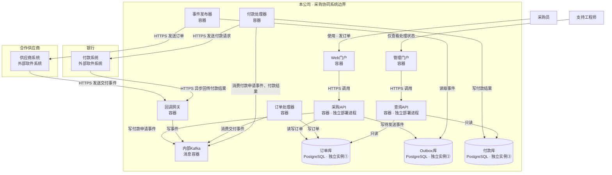
```mermaid
flowchart TB
    buyer["采购员"]
    support["支持工程师"]

    subgraph company["本公司 · 采购协同系统边界"]
        web["Web门户<br/>容器"]
        api["采购API<br/>容器 · 独立部署进程"]
        publisher["事件发布器<br/>容器"]
        gateway["回调网关<br/>容器"]
        kafka["内部Kafka<br/>消息容器"]
        orderProcessor["订单处理器<br/>容器"]
        paymentProcessor["付款处理器<br/>容器"]
        admin["管理门户<br/>容器"]
        query["查询API<br/>容器 · 独立部署进程"]

        orders[("订单库<br/>PostgreSQL · 独立实例①")]
        outbox[("Outbox库<br/>PostgreSQL · 独立实例②")]
        payments[("付款库<br/>PostgreSQL · 独立实例③")]

        web -->|"HTTPS 调用"| api
        api -->|"读写订单"| orders
        api -->|"写待发送事件"| outbox
        api -->|"写付款申请事件"| kafka

        publisher -->|"读取事件"| outbox
        gateway -->|"写事件"| kafka
        orderProcessor -->|"消费交付事件"| kafka
        orderProcessor -->|"写订单"| orders
        paymentProcessor -->|"消费付款申请事件、付款结果"| kafka
        paymentProcessor -->|"写付款结果"| payments

        admin -->|"HTTPS 调用"| query
        query -->|"只读"| orders
        query -->|"只读"| payments
    end

    subgraph supplierOrg["合作供应商"]
        supplier["供应商系统<br/>外部软件系统"]
    end

    subgraph bankOrg["银行"]
        bank["付款系统<br/>外部软件系统"]
    end

    buyer -->|"使用 · 发订单"| web
    support -->|"仅查看处理状态"| admin
    publisher -->|"HTTPS 发送订单"| supplier
    supplier -->|"HTTPS 发送交付事件"| gateway
    paymentProcessor -->|"HTTPS 发送付款请求"| bank
    bank -->|"HTTPS 异步回传付款结果"| gateway
```

这里的“容器”指 C4 的应用或数据运行单元，不限定为 Docker 容器。三个数据库分别运行；采购API与查询API分别部署。消费箭头从处理器指向 Kafka，表示处理器读取事件。未提供容器内部组件信息，因此不展开三级组件视图。

### mermaid-diagrams

[原始回答](outputs/mermaid-diagrams/02-c4.md) · [完整模型输入](model-inputs/mermaid-diagrams/02-c4.txt)

图 1： [SVG](rendered/mermaid-diagrams--02-c4--1.svg) · [PNG原图](rendered/mermaid-diagrams--02-c4--1.png)

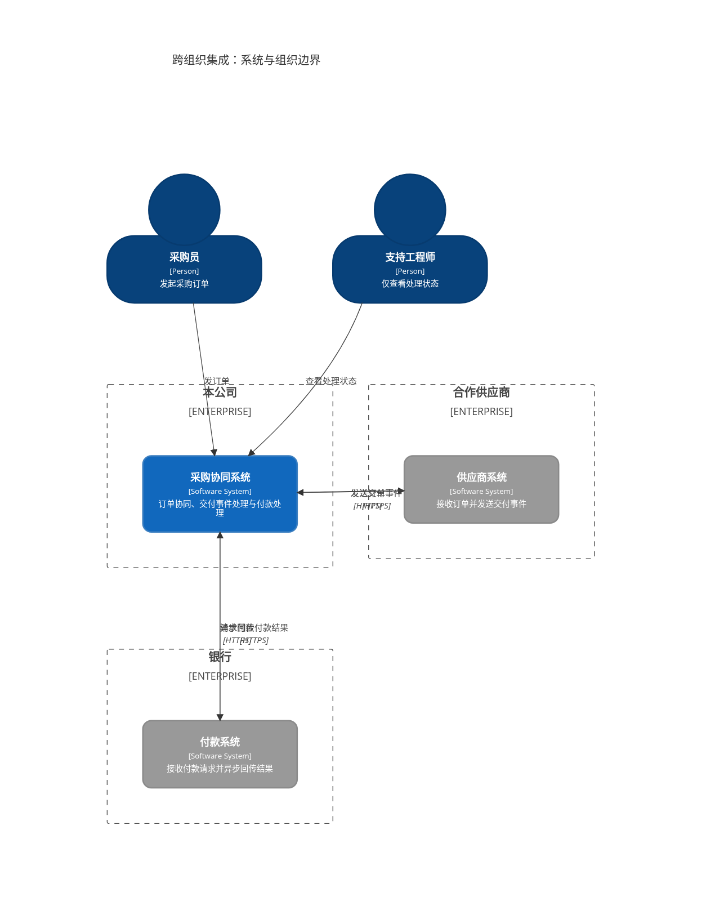

图 2： [SVG](rendered/mermaid-diagrams--02-c4--2.svg) · [PNG原图](rendered/mermaid-diagrams--02-c4--2.png)

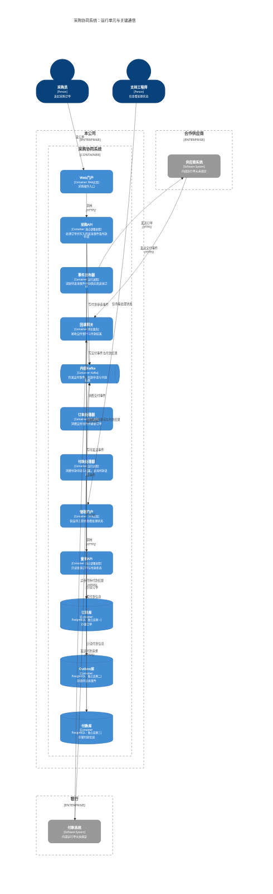

展开未改写的模型回答

业务视图以系统为单位，展示三个组织的所有权边界；工程视图展开本公司的独立运行单元，供应商和银行仍保留为外部系统。

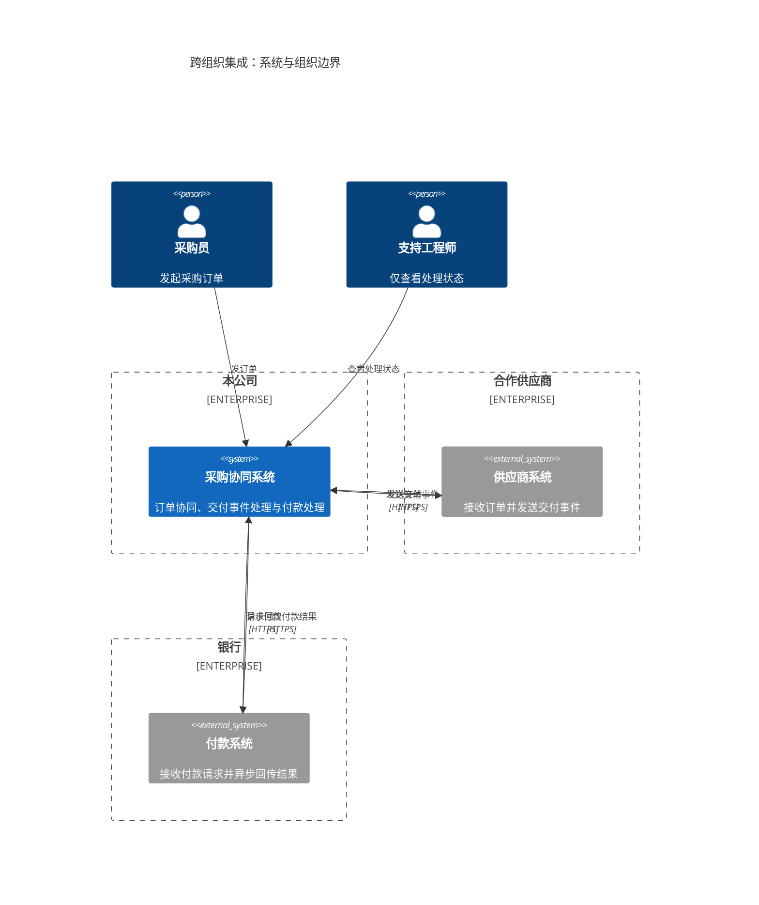
```mermaid
C4Context
    title 跨组织集成：系统与组织边界

    Person(buyer, "采购员", "发起采购订单")
    Person(support, "支持工程师", "仅查看处理状态")

    Enterprise_Boundary(company, "本公司") {
        System(procurement, "采购协同系统", "订单协同、交付事件处理与付款处理")
    }
    Enterprise_Boundary(supplierOrg, "合作供应商") {
        System_Ext(supplier, "供应商系统", "接收订单并发送交付事件")
    }
    Enterprise_Boundary(bankOrg, "银行") {
        System_Ext(bank, "付款系统", "接收付款请求并异步回传结果")
    }

    Rel(buyer, procurement, "发订单")
    Rel(support, procurement, "查看处理状态")
    Rel(procurement, supplier, "发送订单", "HTTPS")
    Rel(supplier, procurement, "发送交付事件", "HTTPS")
    Rel(procurement, bank, "请求付款", "HTTPS")
    Rel(bank, procurement, "异步回传付款结果", "HTTPS")
```

下面的容器视图展示独立应用、进程和数据存储。采购API与查询API分别部署；三个PostgreSQL数据库分别运行在独立实例上。

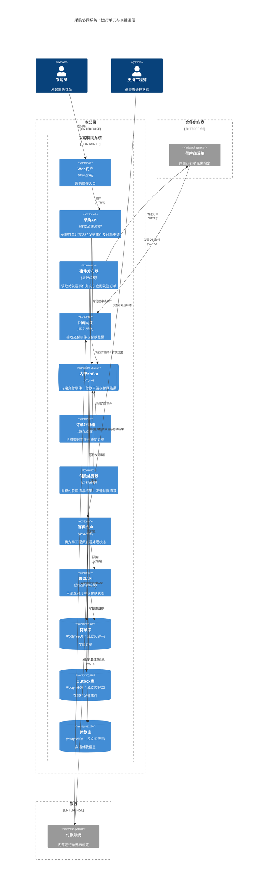
```mermaid
C4Container
    title 采购协同系统：运行单元与关键通信

    Person(buyer, "采购员", "发起采购订单")
    Person(support, "支持工程师", "仅查看处理状态")

    Enterprise_Boundary(company, "本公司") {
        Container_Boundary(procurement, "采购协同系统") {
            Container(web, "Web门户", "Web应用", "采购操作入口")
            Container(purchaseApi, "采购API", "独立部署进程", "处理订单并写入待发送事件及付款申请")
            Container(publisher, "事件发布器", "运行进程", "读取待发送事件并向供应商发送订单")

            Container(callback, "回调网关", "网关服务", "接收交付事件与付款结果")
            ContainerQueue(kafka, "内部Kafka", "Kafka", "传递交付事件、付款申请与付款结果")
            Container(orderProcessor, "订单处理器", "运行进程", "消费交付事件并更新订单")
            Container(paymentProcessor, "付款处理器", "运行进程", "消费付款申请与结果，发送付款请求")

            Container(admin, "管理门户", "Web应用", "供支持工程师查看处理状态")
            Container(queryApi, "查询API", "独立部署进程", "只读查询订单与付款状态")

            ContainerDb(orderDb, "订单库", "PostgreSQL：独立实例一", "存储订单")
            ContainerDb(outboxDb, "Outbox库", "PostgreSQL：独立实例二", "存储待发送事件")
            ContainerDb(paymentDb, "付款库", "PostgreSQL：独立实例三", "存储付款信息")
        }
    }

    Enterprise_Boundary(supplierOrg, "合作供应商") {
        System_Ext(supplier, "供应商系统", "内部运行单元未规定")
    }
    Enterprise_Boundary(bankOrg, "银行") {
        System_Ext(bank, "付款系统", "内部运行单元未规定")
    }

    Rel(buyer, web, "发订单")
    Rel(web, purchaseApi, "调用", "HTTPS")
    Rel(purchaseApi, orderDb, "读写订单")
    Rel(purchaseApi, outboxDb, "写待发送事件")
    Rel(publisher, outboxDb, "读事件")
    Rel(publisher, supplier, "发送订单", "HTTPS")

    Rel(supplier, callback, "发送交付事件", "HTTPS")
    Rel(bank, callback, "异步回传付款结果", "HTTPS")
    Rel(callback, kafka, "写交付事件与付款结果")
    Rel(orderProcessor, kafka, "消费交付事件")
    Rel(orderProcessor, orderDb, "写订单")

    Rel(purchaseApi, kafka, "写付款申请事件")
    Rel(paymentProcessor, kafka, "消费付款申请与付款结果")
    Rel(paymentProcessor, bank, "发送付款请求", "HTTPS")
    Rel(paymentProcessor, paymentDb, "写付款信息")

    Rel(support, admin, "仅查看处理状态")
    Rel(admin, queryApi, "调用", "HTTPS")
    Rel(queryApi, orderDb, "只读订单")
    Rel(queryApi, paymentDb, "只读付款信息")
```

箭头表示调用或数据访问方向，标签明确读、写与消费语义。例如“处理器 → Kafka”表示处理器从Kafka消费事件。系统视图中的跨组织通信，在容器视图中落实到发布器、回调网关和付款处理器；未展开未提供的内部组件或外部系统容器。

### visual-v041

[原始回答](outputs/visual-v041/02-c4.md) · [完整模型输入](model-inputs/visual-v041/02-c4.txt)

图 1： [SVG](rendered/visual-v041--02-c4--1.svg) · [PNG原图](rendered/visual-v041--02-c4--1.png)

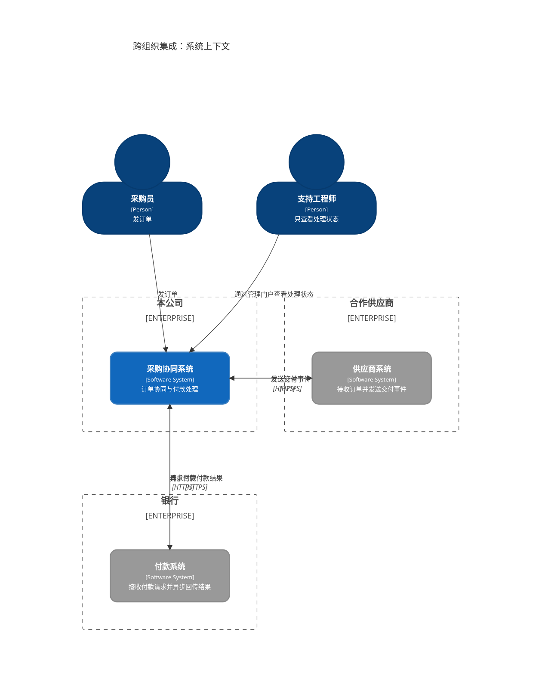

图 2： [SVG](rendered/visual-v041--02-c4--2.svg) · [PNG原图](rendered/visual-v041--02-c4--2.png)

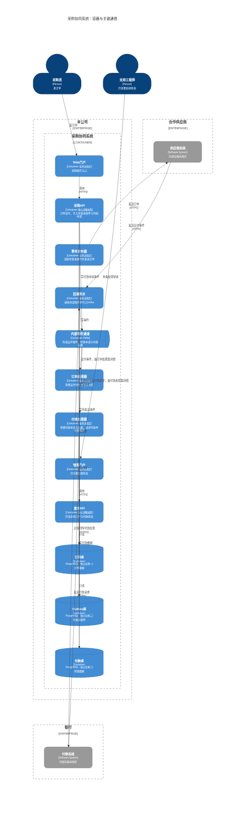

展开未改写的模型回答

**业务视图：系统与组织边界。** 供应商系统、付款系统分别属于合作供应商和银行；本公司拥有采购协同系统。

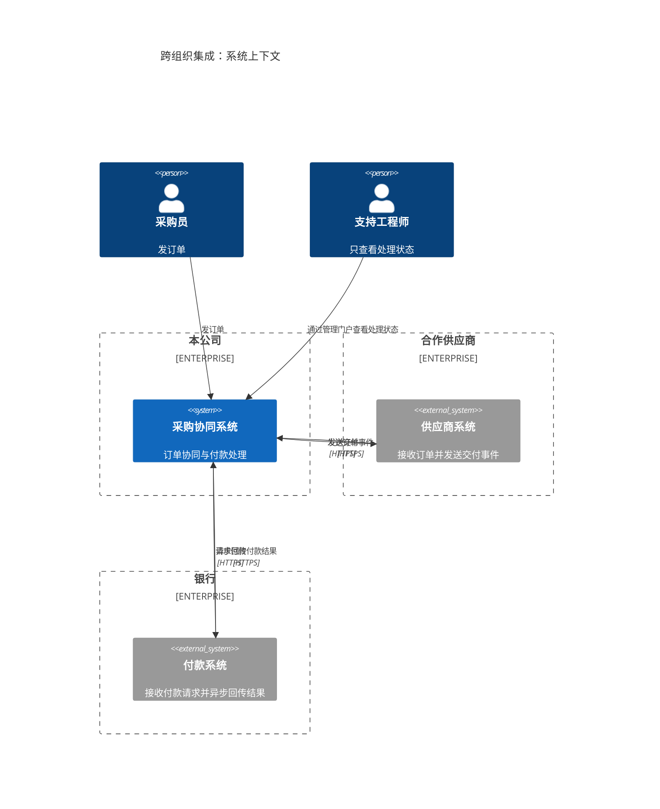
```mermaid
C4Context
    title 跨组织集成：系统上下文

    Person(buyer, "采购员", "发订单")
    Person(support, "支持工程师", "只查看处理状态")

    Enterprise_Boundary(company, "本公司") {
        System(procurement, "采购协同系统", "订单协同与付款处理")
    }
    Enterprise_Boundary(supplier_org, "合作供应商") {
        System_Ext(supplier, "供应商系统", "接收订单并发送交付事件")
    }
    Enterprise_Boundary(bank_org, "银行") {
        System_Ext(bank, "付款系统", "接收付款请求并异步回传结果")
    }

    Rel(buyer, procurement, "发订单")
    Rel(support, procurement, "通过管理门户查看处理状态")
    Rel(procurement, supplier, "发送订单", "HTTPS")
    Rel(supplier, procurement, "发送交付事件", "HTTPS")
    Rel(procurement, bank, "请求付款", "HTTPS")
    Rel(bank, procurement, "异步回传付款结果", "HTTPS")
```

**工程视图：采购协同系统内部的运行单元。** 采购API与查询API独立部署；三个数据库分别是独立的PostgreSQL实例。外部系统保持系统级，不展开其内部结构。

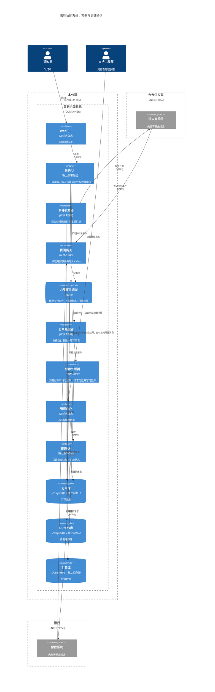
```mermaid
C4Container
    title 采购协同系统：容器与关键通信

    Person(buyer, "采购员", "发订单")
    Person(support, "支持工程师", "只查看处理状态")

    Enterprise_Boundary(company, "本公司") {
        Container_Boundary(procurement, "采购协同系统") {
            Container(web, "Web门户", "技术未指定", "采购操作入口")
            Container(api, "采购API", "独立部署进程", "订单读写、写入待发送事件与付款申请")
            Container(publisher, "事件发布器", "技术未指定", "读取待发送事件并发送订单")
            Container(callback, "回调网关", "技术未指定", "接收外部事件并写入Kafka")
            ContainerQueue(kafka, "内部事件通道", "Kafka", "传递交付事件、付款申请与付款结果")
            Container(order_worker, "订单处理器", "技术未指定", "消费交付事件并写订单库")
            Container(payment_worker, "付款处理器", "技术未指定", "消费付款申请与结果，请求付款并写付款库")
            Container(admin, "管理门户", "技术未指定", "只查看处理状态")
            Container(query, "查询API", "独立部署进程", "只读查询订单与付款状态")

            ContainerDb(order_db, "订单库", "PostgreSQL：独立实例一", "订单数据")
            ContainerDb(outbox_db, "Outbox库", "PostgreSQL：独立实例二", "待发送事件")
            ContainerDb(payment_db, "付款库", "PostgreSQL：独立实例三", "付款数据")
        }
    }

    Enterprise_Boundary(supplier_org, "合作供应商") {
        System_Ext(supplier, "供应商系统", "内部容器未规定")
    }
    Enterprise_Boundary(bank_org, "银行") {
        System_Ext(bank, "付款系统", "内部容器未规定")
    }

    Rel(buyer, web, "发订单")
    Rel(web, api, "调用", "HTTPS")
    Rel(api, order_db, "读写订单")
    Rel(api, outbox_db, "写待发送事件")
    Rel(api, kafka, "写付款申请事件")

    Rel(publisher, outbox_db, "读事件")
    Rel(publisher, supplier, "发送订单", "HTTPS")

    Rel(supplier, callback, "发送交付事件", "HTTPS")
    Rel(bank, callback, "异步回传付款结果", "HTTPS")
    Rel(callback, kafka, "写事件")
    Rel(kafka, order_worker, "交付事件，由订单处理器消费")
    Rel(kafka, payment_worker, "付款申请与付款结果，由付款处理器消费")
    Rel(order_worker, order_db, "写订单")
    Rel(payment_worker, payment_db, "写付款数据")
    Rel(payment_worker, bank, "发送付款请求", "HTTPS")

    Rel(support, admin, "查看处理状态")
    Rel(admin, query, "调用", "HTTPS")
    Rel(query, order_db, "只读")
    Rel(query, payment_db, "只读")
```

数据库连线标明访问方及读写操作；Kafka到处理器的箭头表示事件流向。未规定的通信协议、Kafka主题和外部内部结构均未补充。以上为可编辑源码，未运行语法检查或实际渲染。

