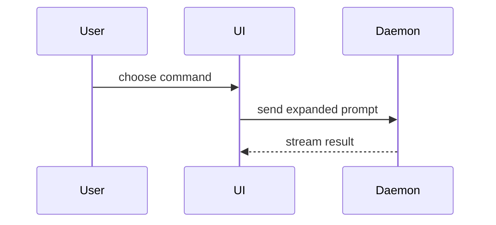

# 用视觉表达帮助理解

按 show-me 原文选择和组织视图，只表达当前内容，不承担内容研究或领域决策。以下仅补充上游未覆盖的要求；冲突时以补充为准。

## 本地补充

- **忠实原意。** 保留给定的主体、关系、条件以及假设、建议和未知；不为图完整补造事实，不把不确定内容画成确定结论。
- **验证与交付。** 区分语法检查与实际渲染，如实说明未完成的检查；普通文本、伪代码和 diff 无需渲染提示。按调用者要求展示或保存可编辑源。上游打开 HTML 的步骤仅在环境支持且任务允许时执行，否则提供文件位置与查看方式。

## 主动使用 mermaid-diagrams

选用 Mermaid 表达时，若环境提供可由模型使用的 mermaid-diagrams，主动加载其指引或通过支持的接口调用，按图种读取所需参考，不等待用户另行触发。用它补充 show-me 的图种与语法细节，保留当前内容和关键条件，不扩展原任务。

若未安装或仅允许用户手动调用，直接生成 Mermaid，不要求用户再调用另一个入口，也不声称已使用它。该 Skill 是表达指引，不默认提供解析器或渲染器；实际检查使用环境中可用的工具。

## show-me 上游正文（完整保留）

Help the user understand the current topic of conversation visually. Skip the preamble and keep prose brief. Pick the smallest view that makes the key point clear.

- Show logic or an algorithm as pseudocode:

```text
on(save)
  if content is unchanged
    return cached result
  write new content
  return fresh result
```

- Show runtime control flow as a call tree:

```text
submitForm
  createSession
    persistPrompt
    launchAgent
  navigateToSession
```

- Show UI structure as a component tree, including state and module boundaries that matter:

```tsx
<SessionPage> (apps/example/src/routes/session.tsx)
  useSessionEvents()
  <SessionToolbar>
    <RunSkillButton> (packages/ui)
```

- Show file responsibility or a broad refactor as a shallow file tree:

```text
src/
├── commands/       # parses user actions
├── sessions/       # owns session state
└── transport/      # sends API requests
```

- Show component interaction, control flow, or data flow with Mermaid:



- Use `diff` when the point is what changes and the surrounding shape already exists. Match the diff shape to the topic.

For a component change:

```diff
 <SessionPage>
   useSessionEvents()
   <SessionToolbar>
+    <RunSkillButton />
   <SessionTimeline>
+    <SkillResultCard />
```

For a file-layout change:

```diff
 src/
 ├── commands/
+│   └── show-me.ts       # expands the slash command
 ├── sessions/
-└── transport.ts
+└── transport/
+    ├── client.ts
+    └── stream.ts
```

For a call-tree or call-stack change:

```diff
 submitForm
   createSession
     persistPrompt
+    expandSkillMention
     launchAgent
-  navigateToSession
+  navigateToSession
+    subscribeToEvents
```

For a state or control-flow change:

```diff
 on(save)
-  write content
+  if content is unchanged
+    return cached result
+  write new content
+  invalidate cache
```

- Show the whole block when most of it is new, when omitted context would hide ownership or order, or when the user needs a copyable target shape:

```ts
function expandSkill(command: string): string {
  const skillName = command.slice(1)
  return `use the ${skillName} skill`
}
```

- For a visual UI, layout, state comparison, or concept too dense for Mermaid, write one focused HTML file — a diagram, an infographic, or a short slide deck, whichever fits the point. Match the product's colors, type, spacing, and components; use real labels and data; support desktop and mobile. Then open it for the user:

```
Bash(open path/to/show-me-{description}.html)
```

### guidance

Place each visual next to the short text it supports. Keep only the calls, files, props, states, and boundaries needed to answer the user's current question or the options to resolve the current discussion point.

You may use one of these, you may use several, it is unlikely you will use all of them. Use your judgement and don't overwhelm the user.
