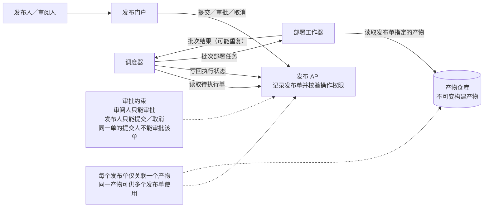
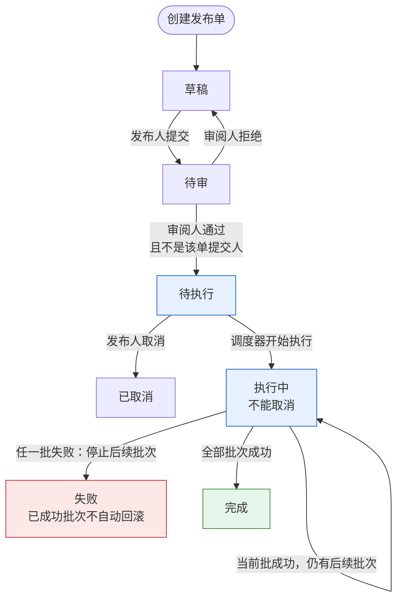
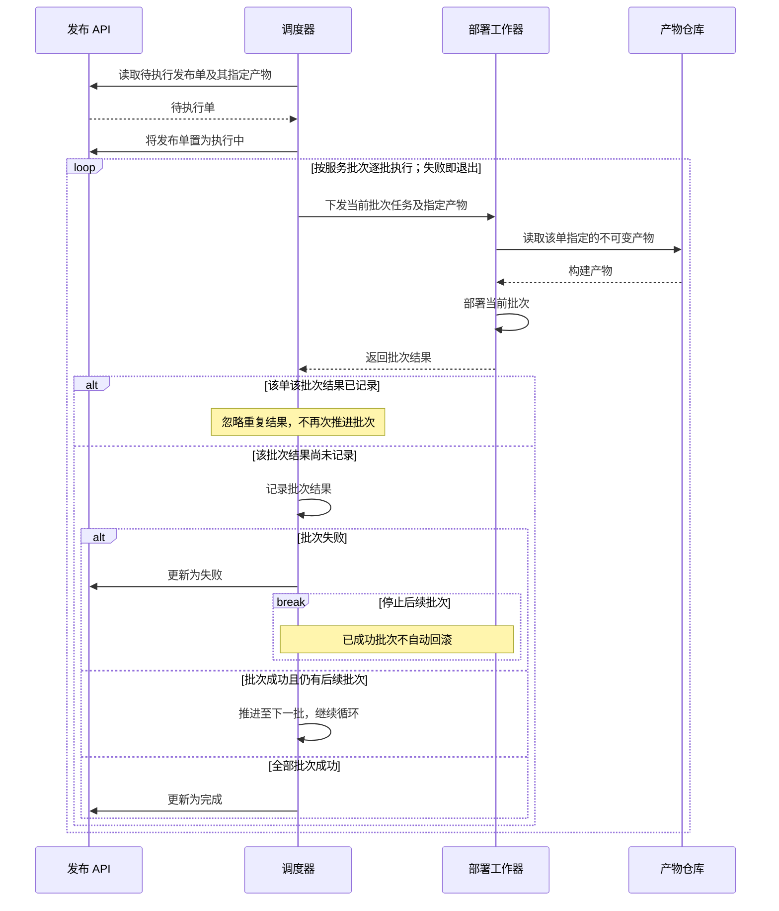

下面三个视图分别说明组件协作、状态变化和批次执行。

```mermaid
flowchart LR
    U["发布人／审阅人"] --> P["发布门户"]
    P -->|"提交／审批／取消"| A["发布 API<br/>记录发布单并校验操作权限"]
    S["调度器"] -->|"读取待执行单"| A
    S -->|"写回执行状态"| A
    S -->|"批次部署任务"| W["部署工作器"]
    W -->|"批次结果（可能重复）"| S
    W -->|"读取发布单指定的产物"| R[("产物仓库<br/>不可变构建产物")]

    C["审批约束<br/>审阅人只能审批<br/>发布人只能提交／取消<br/>同一单的提交人不能审批该单"]
    C -.-> A

    B["每个发布单仅关联一个产物<br/>同一产物可供多个发布单使用"]
    B -.-> A
    B -.-> R
```

一个人可以同时拥有发布人和审阅人角色，但审批时仍须检查其是否为该单提交人；拥有审阅人角色不能绕过这条约束。

```mermaid
flowchart TD
    N([创建发布单]) --> D["草稿"]
    D -->|"发布人提交"| R["待审"]
    R -->|"审阅人拒绝"| D
    R -->|"审阅人通过<br/>且不是该单提交人"| Q["待执行"]
    Q -->|"发布人取消"| C["已取消"]
    Q -->|"调度器开始执行"| E["执行中<br/>不能取消"]
    E -->|"当前批成功，仍有后续批次"| E
    E -->|"任一批失败：停止后续批次"| F["失败<br/>已成功批次不自动回滚"]
    E -->|"全部批次成功"| S["完成"]

    classDef success fill:#e5f5e9,stroke:#388e3c
    classDef failure fill:#fde8e8,stroke:#c62828
    classDef active fill:#e6f0ff,stroke:#1565c0
    class S success
    class F failure
    class Q,E active
```

审批和提交／取消分别受角色限制；进入执行中以及后续执行状态的推进仅由调度器负责。

```mermaid
sequenceDiagram
    participant API as 发布 API
    participant S as 调度器
    participant W as 部署工作器
    participant R as 产物仓库

    S->>API: 读取待执行发布单及其指定产物
    API-->>S: 待执行单
    S->>API: 将发布单置为执行中

    loop 按服务批次逐批执行；失败即退出
        S->>W: 下发当前批次任务及指定产物
        W->>R: 读取该单指定的不可变产物
        R-->>W: 构建产物
        W->>W: 部署当前批次
        W-->>S: 返回批次结果

        alt 该单该批次结果已记录
            Note over S: 忽略重复结果，不再次推进批次
        else 该批次结果尚未记录
            S->>S: 记录批次结果
            alt 批次失败
                S->>API: 更新为失败
                break 停止后续批次
                    Note over S,W: 已成功批次不自动回滚
                end
            else 批次成功且仍有后续批次
                S->>S: 推进至下一批，继续循环
            else 全部批次成功
                S->>API: 更新为完成
            end
        end
    end
```

批次去重的范围是“同一发布单、同一批次”。以上未补入数据库、消息队列、通知、超时、自动重试或失败后恢复机制；这些方案尚未提供。