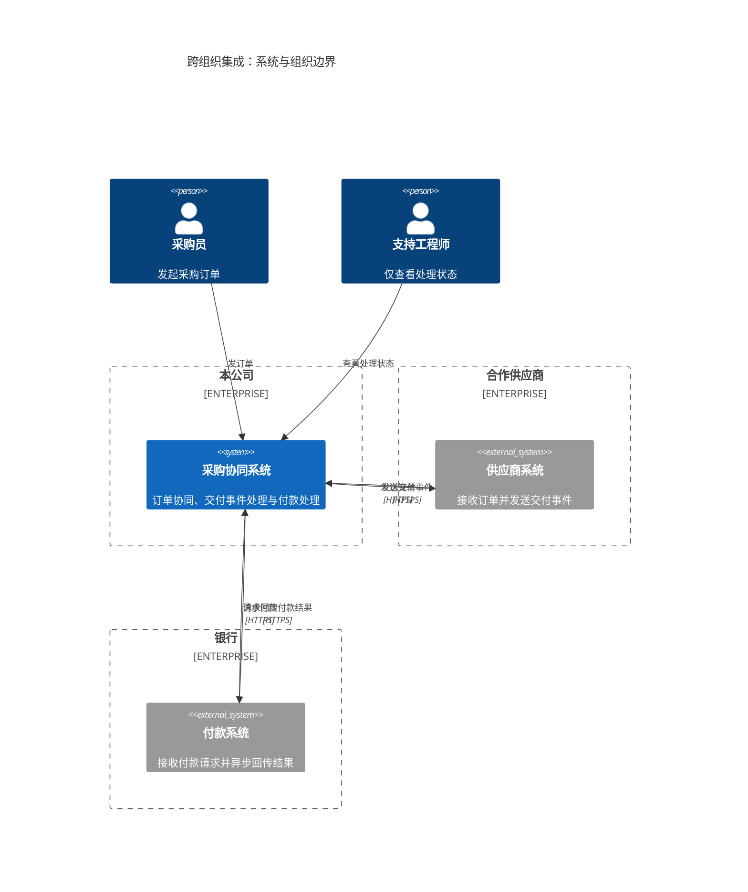
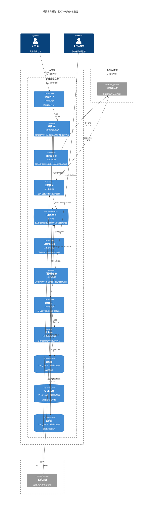

业务视图以系统为单位，展示三个组织的所有权边界；工程视图展开本公司的独立运行单元，供应商和银行仍保留为外部系统。

下面的容器视图展示独立应用、进程和数据存储。采购API与查询API分别部署；三个PostgreSQL数据库分别运行在独立实例上。

箭头表示调用或数据访问方向，标签明确读、写与消费语义。例如“处理器 → Kafka”表示处理器从Kafka消费事件。系统视图中的跨组织通信，在容器视图中落实到发布器、回调网关和付款处理器；未展开未提供的内部组件或外部系统容器。