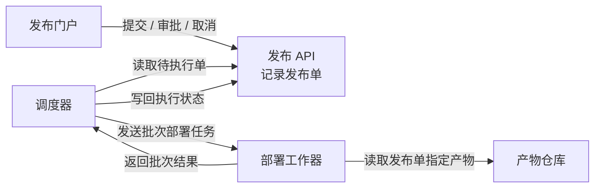
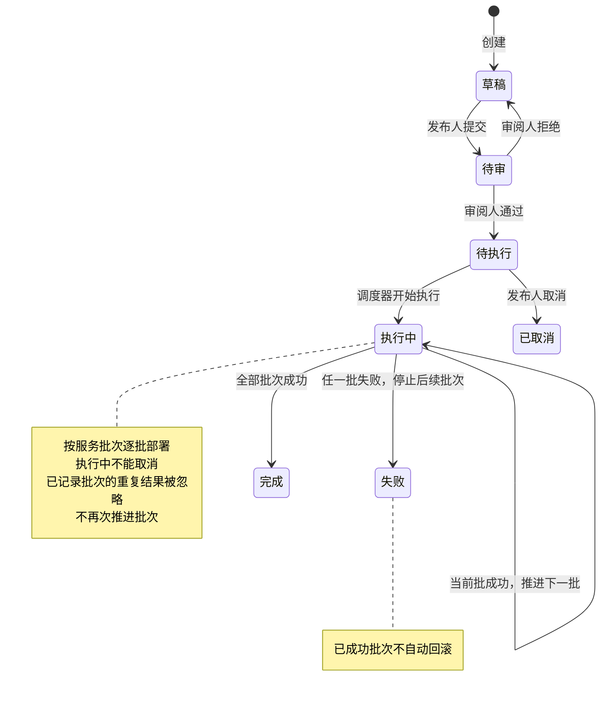

### 各部分怎样协作

每张发布单**仅关联一个不可变构建产物**；同一产物可供多张发布单使用。调度器根据工作器返回的结果更新发布状态。

### 发布状态与异常

调度器**只执行待执行单**，先将其置为执行中，再派发批次任务。只有当前批成功，才推进下一批。

### 审批与执行的权限边界

| 操作者 | 允许的动作 | 约束落点 |
|---|---|---|
| 发布人 | 提交、取消 | 提交：草稿 → 待审；取消：仅待执行时 |
| 审阅人 | 审批通过、拒绝 | 仅待审时；**不能审批自己提交的同一张单** |
| 调度器 | 推进执行状态 | 待执行 → 执行中；依据批次结果推进至失败或完成 |

一个人可以同时拥有发布人和审阅人角色，但审批时仍须检查**该单的提交人身份**。这些约束应在发布 API 接受操作、记录状态变更的边界生效；门户提供操作入口。调度器负责执行状态推进和批次结果去重。

以上仅展示已确认体系；数据库、消息队列、通知、超时、自动重试及失败后恢复方案均未提供。