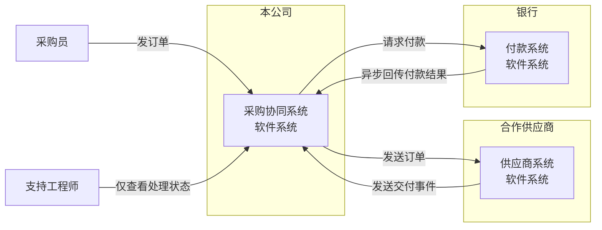
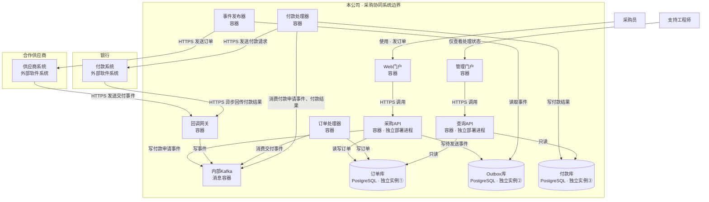

### C4 一级：系统上下文——组织与系统边界

供业务负责人查看：三个系统分别归属本公司、合作供应商与银行；跨组织通信以系统为单位展示。

### C4 二级：容器——本公司内部运行单元与通信

供工程师查看：展开采购协同系统。框内均为容器级运行单元；供应商系统与银行付款系统保持为外部软件系统，不展开内部结构。箭头表示调用、写入或读取操作的发起方向。

这里的“容器”指 C4 的应用或数据运行单元，不限定为 Docker 容器。三个数据库分别运行；采购API与查询API分别部署。消费箭头从处理器指向 Kafka，表示处理器读取事件。未提供容器内部组件信息，因此不展开三级组件视图。