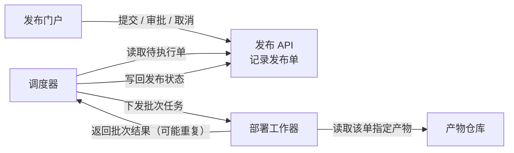
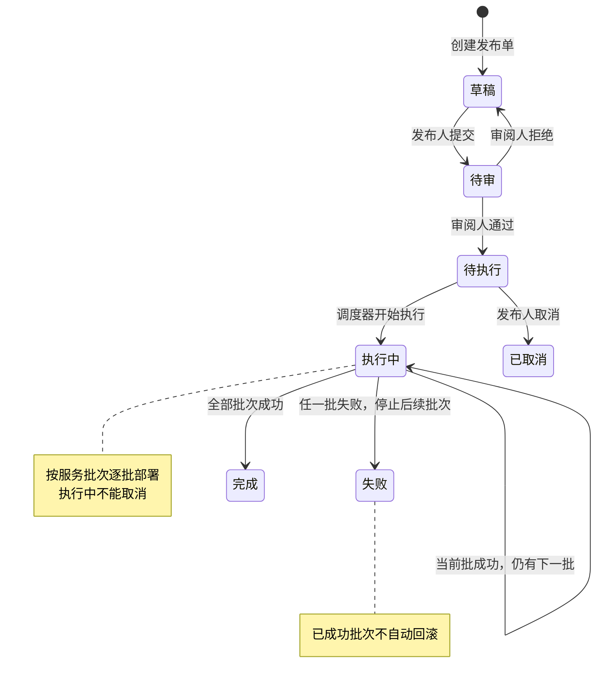
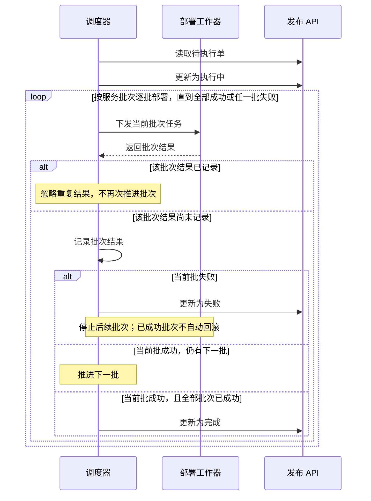

**协作关系：发布单绑定产物，调度器组织部署，工作器执行批次。**

每张发布单**关联且仅关联一个不可变构建产物**；同一产物可以被多张发布单使用。

**状态演变：先审批，再执行；失败保留已经成功的部署。**

**批次推进：每批成功才继续，同一批结果只处理一次。**

**审批约束针对具体发布单，拥有双角色也不能自审。**

| 主体 | 允许的操作 | 关键约束 |
|---|---|---|
| 发布人 | 提交、取消 | 仅待执行可取消；执行中不能取消 |
| 审阅人 | 审批（通过或拒绝） | 不能审批自己提交的同一张单 |
| 调度器 | 推进执行状态 | 只执行待执行单，根据批次结果推进 |

一个人可以同时拥有发布人和审阅人角色，但**该单提交人与审批人必须不同**。这些约束适用于门户向 API 发起的发布单操作；材料未指定具体权限校验实现位置。

图中未补入数据库、消息队列、通知、超时、自动重试或失败后恢复机制。以上为可编辑 Mermaid 源码，未进行工具语法检查或实际渲染。