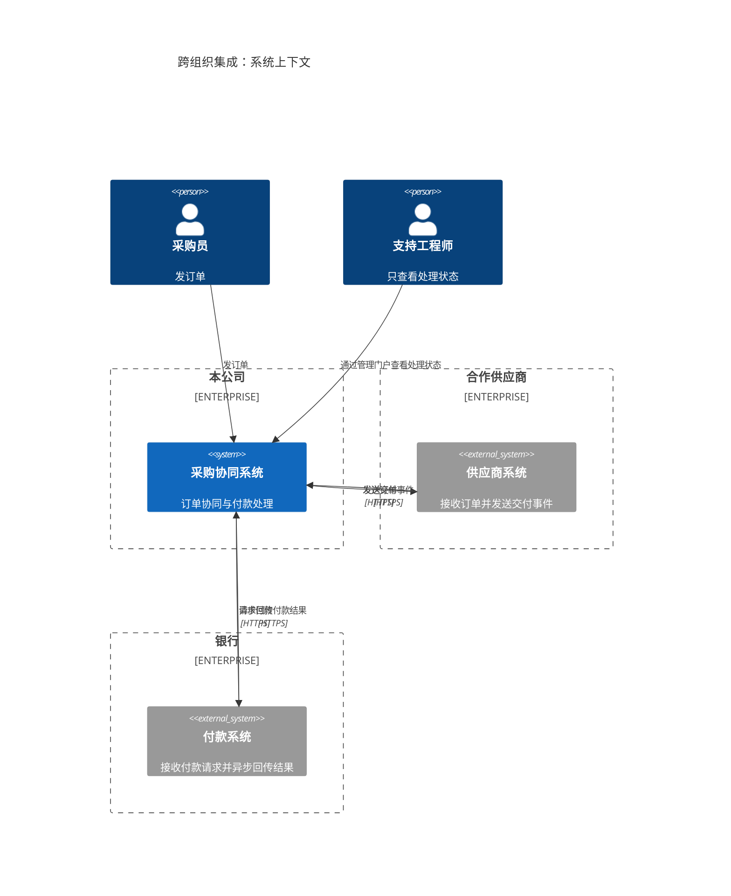
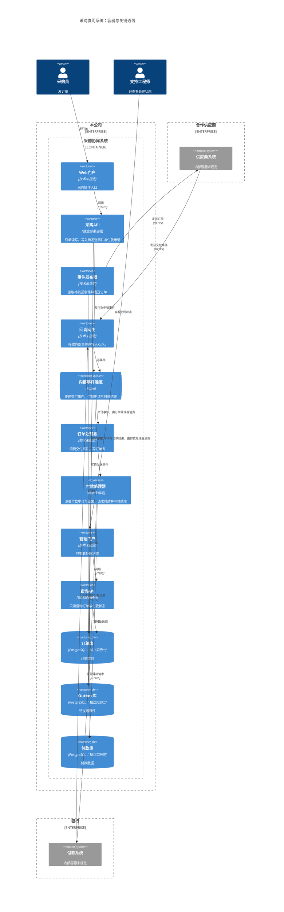

**业务视图：系统与组织边界。** 供应商系统、付款系统分别属于合作供应商和银行；本公司拥有采购协同系统。

**工程视图：采购协同系统内部的运行单元。** 采购API与查询API独立部署；三个数据库分别是独立的PostgreSQL实例。外部系统保持系统级，不展开其内部结构。

数据库连线标明访问方及读写操作；Kafka到处理器的箭头表示事件流向。未规定的通信协议、Kafka主题和外部内部结构均未补充。以上为可编辑源码，未运行语法检查或实际渲染。