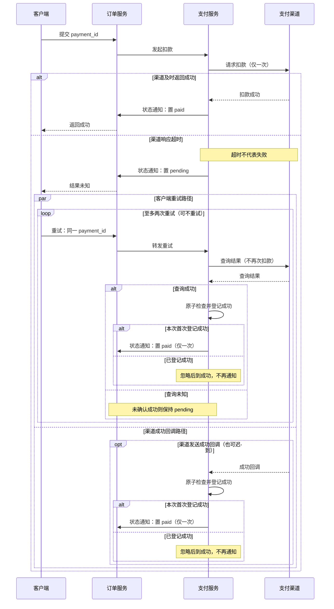
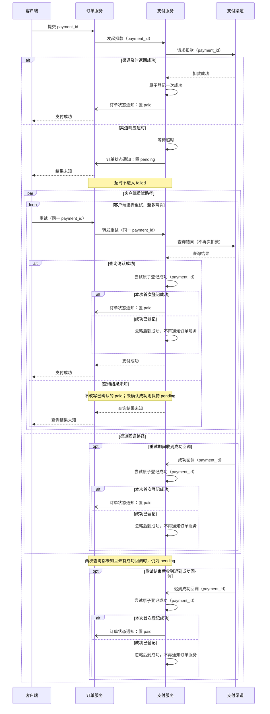
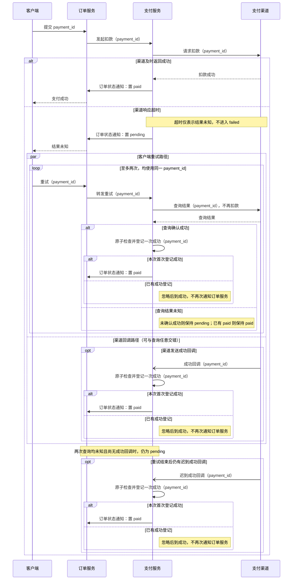
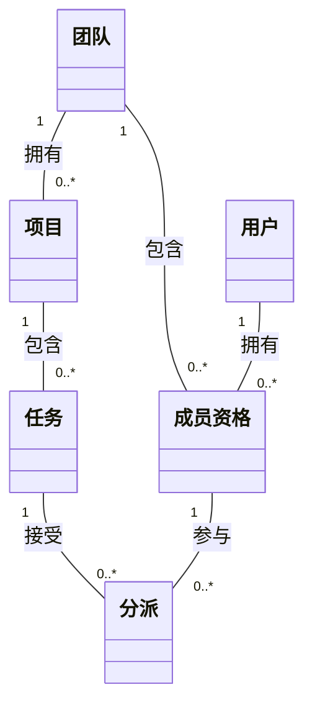
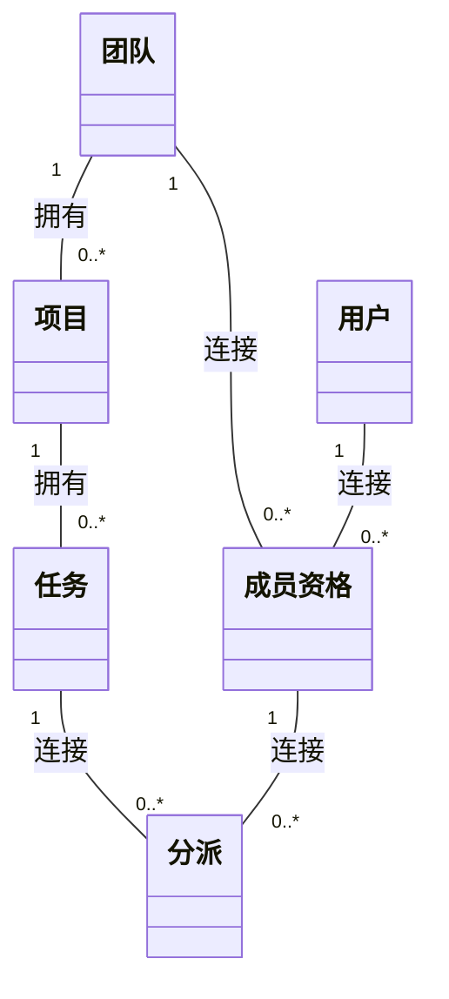
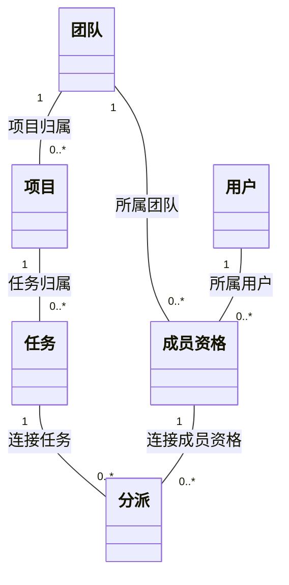

# 复杂时序与数量关系：三组、每组两份独立输出

以下逐字汇集未改写的原始回答，方法、检查和结论见[报告](README.md)。

## 01-concurrent

请把以下已确认的支付交互画成时序图，准确展示并发、重试、条件分支及迟到消息，不重新设计系统。参与者为客户端、订单服务、支付服务、支付渠道。客户端向订单服务提交payment_id；订单服务向支付服务发起扣款；支付服务向渠道请求扣款。渠道及时返回成功时，支付服务通知订单服务置paid并返回客户端。若渠道响应超时，支付服务通知订单服务置pending并向客户端返回“结果未知”，超时不进入failed。超时之后两条路径可并发：客户端至多两次以同一payment_id重试，订单服务把重试转给支付服务，支付服务每次只向渠道查询结果，不再次请求扣款；同时渠道可能发送成功回调到支付服务。查询或回调首先确认成功时，支付服务原子登记一次成功并通知订单服务置paid；后到的成功结果被支付服务忽略，不再次通知订单服务。两次查询都未知时保持pending，之后仍可接受迟到的成功回调。没有提供渠道明确失败时的处理或退款流程，不添加这些分支。图中区分渠道扣款、结果查询和订单状态通知；简短中文，保留必要细节。

### show-me

[原文件](outputs/show-me/01-concurrent.md)

两条并发路径共享同一 `payment_id` 的原子成功登记；查询与回调谁先登记成功，谁触发唯一一次 `paid` 通知。两次查询均未知且尚无成功回调时保持 `pending`；重试结束后仍可收到并处理迟到回调。未添加明确失败或退款分支。

### mermaid-diagrams

[原文件](outputs/mermaid-diagrams/01-concurrent.md)

并发块允许查询与回调交错，回调是可选事件，不要求重试等待它。所有成功确认共用同一原子登记规则，只有首次成功通知订单服务。

### visual-v041

[原文件](outputs/visual-v041/01-concurrent.md)

查询与回调谁先成功登记，谁通知置 `paid`；检查和登记是同一原子操作。未添加明确失败或退款分支。未运行语法检查或实际渲染。

## 02-cardinality

请用一张领域关系图解释下列全部数量关系和约束，可按内容选择类图或实体关系图，不把领域规则写成已有数据库实现：平台有团队、用户、成员资格、项目、任务、分派六个概念。每个成员资格连接且只连接一个团队与一个用户；团队可有零到多个成员资格，用户也可有零到多个成员资格。每个项目属于且只属于一个团队；团队可有零到多个项目。每个任务属于且只属于一个项目，项目可有零到多个任务。每个分派连接且只连接一个任务与一个成员资格；任务可暂时没有分派或有多个分派，一个成员资格可没有分派或有多个分派。分派中的成员资格必须来自任务所属项目的团队；同一任务与同一成员资格最多有一个分派。用户退出团队只停用成员资格，历史分派仍保留；未规定删除团队、项目、任务或用户的行为，没有表结构、外键或级联删除设计。保留中文概念名称，用简短中文说明普通关系线无法完整表达的约束，不增加新政策。

### show-me

[原文件](outputs/show-me/02-cardinality.md)

`1` 表示恰好一个，`0..*` 表示零到多个。关系线之外还须满足：

- 分派的成员资格所属团队，必须等于其任务所属项目的团队。
- 同一任务与同一成员资格最多有一个分派。
- 用户退出团队只停用成员资格，历史分派仍保留。

团队、项目、任务和用户的删除行为未规定；此图仅表达领域关系与约束。

### mermaid-diagrams

[原文件](outputs/mermaid-diagrams/02-cardinality.md)

`1` 表示恰好一个，`0..*` 表示零到多个。成员资格连接一个团队和一个用户；分派连接一个任务和一个成员资格。

普通关系线之外的约束：
- 分派的成员资格所属团队，必须等于任务所属项目的团队。
- 同一任务与同一成员资格最多有一个分派。
- 用户退出团队只停用成员资格，历史分派仍保留。

图中使用普通关联；团队、项目、任务和用户的删除行为未规定。

### visual-v041

[原文件](outputs/visual-v041/02-cardinality.md)

`1` 表示恰好一个，`0..*` 表示零到多个。关系线表达领域关联。

普通关系线之外的约束：

- 每个分派的成员资格所属团队，必须等于其任务所属项目的团队。
- 同一任务与同一成员资格最多有一个分派。
- 用户退出团队只停用成员资格，历史分派仍保留。

团队、项目、任务或用户的删除行为未规定；此图不指定表结构、外键或级联删除。

已提供可编辑 Mermaid 源码，未运行语法检查或实际渲染。

