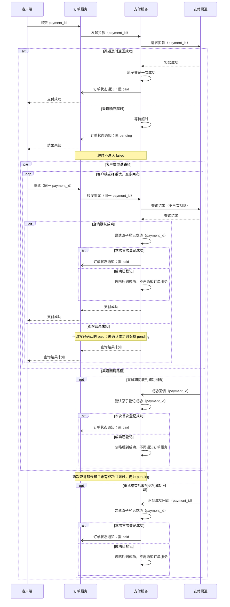

```mermaid
sequenceDiagram
    participant C as 客户端
    participant O as 订单服务
    participant P as 支付服务
    participant G as 支付渠道

    C->>O: 提交 payment_id
    O->>P: 发起扣款（payment_id）
    P->>G: 请求扣款（payment_id）
    alt 渠道及时返回成功
        G-->>P: 扣款成功
        P->>P: 原子登记一次成功
        P-)O: 订单状态通知：置 paid
        O-->>C: 支付成功
    else 渠道响应超时
        P->>P: 等待超时
        P-)O: 订单状态通知：置 pending
        O-->>C: 结果未知
        Note over O,P: 超时不进入 failed

        %% 两条路径可交错；成功登记按同一 payment_id 原子竞争
        par 客户端重试路径
            loop 客户端选择重试，至多两次
                C->>O: 重试（同一 payment_id）
                O->>P: 转发重试（同一 payment_id）
                P->>G: 查询结果（不再次扣款）
                G-->>P: 查询结果
                alt 查询确认成功
                    P->>P: 尝试原子登记成功（payment_id）
                    alt 本次首次登记成功
                        P-)O: 订单状态通知：置 paid
                    else 成功已登记
                        P->>P: 忽略后到成功，不再通知订单服务
                    end
                    P-->>O: 支付成功
                    O-->>C: 支付成功
                else 查询结果未知
                    Note over O,P: 不改写已确认的 paid；未确认成功则保持 pending
                    P-->>O: 查询结果未知
                    O-->>C: 查询结果未知
                end
            end
        and 渠道回调路径
            opt 重试期间收到成功回调
                G-)P: 成功回调（payment_id）
                P->>P: 尝试原子登记成功（payment_id）
                alt 本次首次登记成功
                    P-)O: 订单状态通知：置 paid
                else 成功已登记
                    P->>P: 忽略后到成功，不再通知订单服务
                end
            end
        end

        Note over O,P: 两次查询都未知且未有成功回调时，仍为 pending
        opt 重试结束后收到迟到成功回调
            G-)P: 迟到成功回调（payment_id）
            P->>P: 尝试原子登记成功（payment_id）
            alt 本次首次登记成功
                P-)O: 订单状态通知：置 paid
            else 成功已登记
                P->>P: 忽略后到成功，不再通知订单服务
            end
        end
    end
```

并发块允许查询与回调交错，回调是可选事件，不要求重试等待它。所有成功确认共用同一原子登记规则，只有首次成功通知订单服务。
