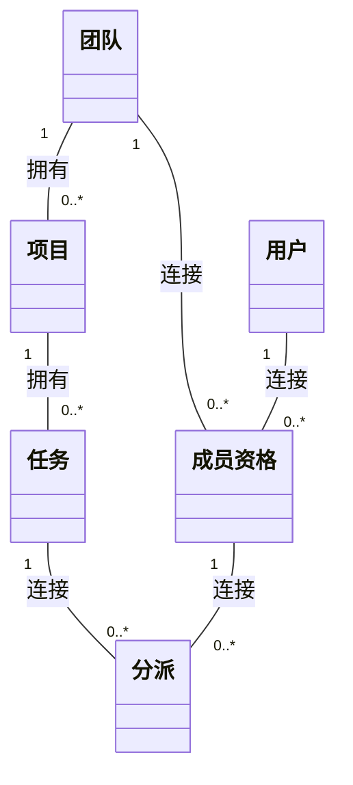

```mermaid
classDiagram
    class Team["团队"]
    class User["用户"]
    class Membership["成员资格"]
    class Project["项目"]
    class Task["任务"]
    class Assignment["分派"]

    Team "1" -- "0..*" Membership : 连接
    User "1" -- "0..*" Membership : 连接
    Team "1" -- "0..*" Project : 拥有
    Project "1" -- "0..*" Task : 拥有
    Task "1" -- "0..*" Assignment : 连接
    Membership "1" -- "0..*" Assignment : 连接
```

`1` 表示恰好一个，`0..*` 表示零到多个。成员资格连接一个团队和一个用户；分派连接一个任务和一个成员资格。

普通关系线之外的约束：
- 分派的成员资格所属团队，必须等于任务所属项目的团队。
- 同一任务与同一成员资格最多有一个分派。
- 用户退出团队只停用成员资格，历史分派仍保留。

图中使用普通关联；团队、项目、任务和用户的删除行为未规定。
