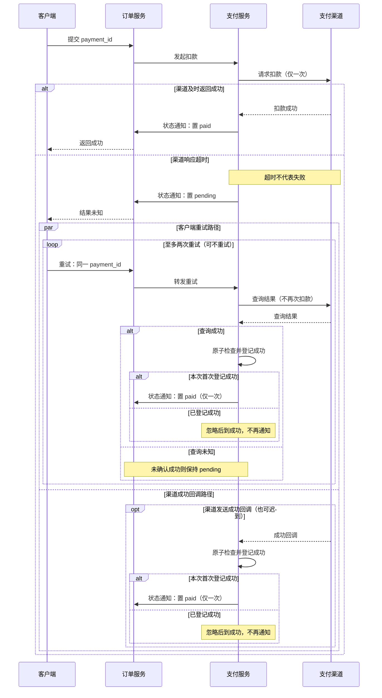

```mermaid
sequenceDiagram
    participant C as 客户端
    participant O as 订单服务
    participant P as 支付服务
    participant G as 支付渠道

    C->>O: 提交 payment_id
    O->>P: 发起扣款
    P->>G: 请求扣款（仅一次）
    alt 渠道及时返回成功
        G-->>P: 扣款成功
        P->>O: 状态通知：置 paid
        O-->>C: 返回成功
    else 渠道响应超时
        Note over P,G: 超时不代表失败
        P->>O: 状态通知：置 pending
        O-->>C: 结果未知
        par 客户端重试路径
            loop 至多两次重试（可不重试）
                C->>O: 重试：同一 payment_id
                O->>P: 转发重试
                P->>G: 查询结果（不再次扣款）
                G-->>P: 查询结果
                alt 查询成功
                    P->>P: 原子检查并登记成功
                    alt 本次首次登记成功
                        P->>O: 状态通知：置 paid（仅一次）
                    else 已登记成功
                        Note over P: 忽略后到成功，不再通知
                    end
                else 查询未知
                    Note over P,O: 未确认成功则保持 pending
                end
            end
        and 渠道成功回调路径
            opt 渠道发送成功回调（也可迟到）
                G-->>P: 成功回调
                P->>P: 原子检查并登记成功
                alt 本次首次登记成功
                    P->>O: 状态通知：置 paid（仅一次）
                else 已登记成功
                    Note over P: 忽略后到成功，不再通知
                end
            end
        end
    end
```

两条并发路径共享同一 `payment_id` 的原子成功登记；查询与回调谁先登记成功，谁触发唯一一次 `paid` 通知。两次查询均未知且尚无成功回调时保持 `pending`；重试结束后仍可收到并处理迟到回调。未添加明确失败或退款分支。
