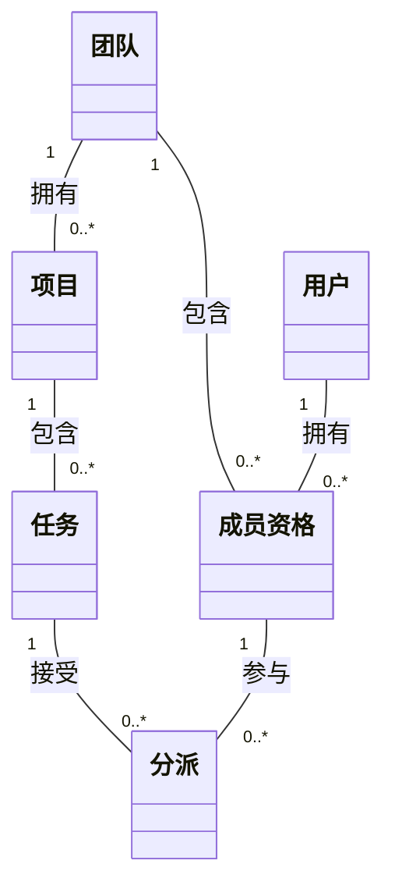

```mermaid
classDiagram
    class 团队
    class 用户
    class 成员资格
    class 项目
    class 任务
    class 分派

    团队 "1" -- "0..*" 成员资格 : 包含
    用户 "1" -- "0..*" 成员资格 : 拥有
    团队 "1" -- "0..*" 项目 : 拥有
    项目 "1" -- "0..*" 任务 : 包含
    任务 "1" -- "0..*" 分派 : 接受
    成员资格 "1" -- "0..*" 分派 : 参与
```

`1` 表示恰好一个，`0..*` 表示零到多个。关系线之外还须满足：

- 分派的成员资格所属团队，必须等于其任务所属项目的团队。
- 同一任务与同一成员资格最多有一个分派。
- 用户退出团队只停用成员资格，历史分派仍保留。

团队、项目、任务和用户的删除行为未规定；此图仅表达领域关系与约束。
