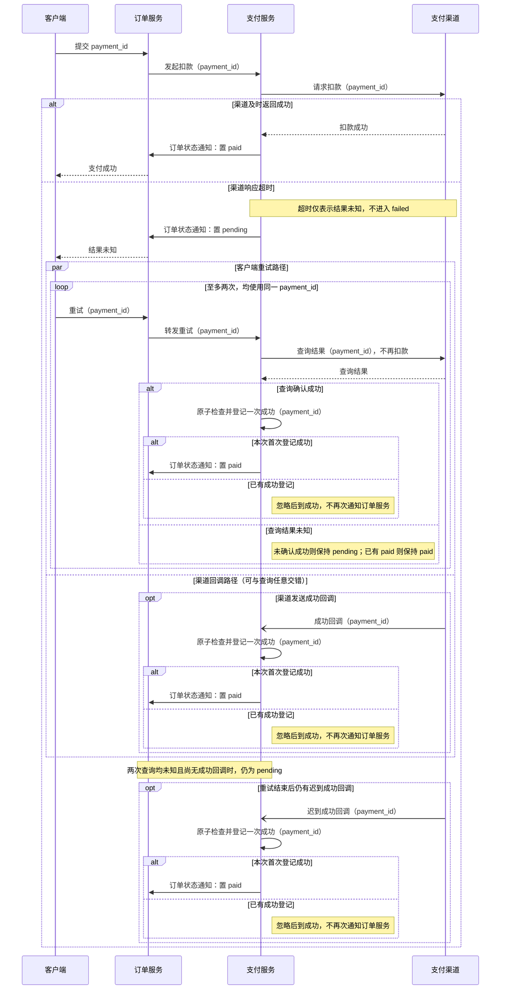

```mermaid
sequenceDiagram
    participant C as 客户端
    participant O as 订单服务
    participant P as 支付服务
    participant G as 支付渠道

    C->>O: 提交 payment_id
    O->>P: 发起扣款（payment_id）
    P->>G: 请求扣款（payment_id）
    alt 渠道及时返回成功
        G-->>P: 扣款成功
        P->>O: 订单状态通知：置 paid
        O-->>C: 支付成功
    else 渠道响应超时
        Note over P,G: 超时仅表示结果未知，不进入 failed
        P->>O: 订单状态通知：置 pending
        O-->>C: 结果未知
        par 客户端重试路径
            loop 至多两次，均使用同一 payment_id
                C->>O: 重试（payment_id）
                O->>P: 转发重试（payment_id）
                P->>G: 查询结果（payment_id），不再扣款
                G-->>P: 查询结果
                alt 查询确认成功
                    P->>P: 原子检查并登记一次成功（payment_id）
                    alt 本次首次登记成功
                        P->>O: 订单状态通知：置 paid
                    else 已有成功登记
                        Note right of P: 忽略后到成功，不再次通知订单服务
                    end
                else 查询结果未知
                    Note right of P: 未确认成功则保持 pending；已有 paid 则保持 paid
                end
            end
        and 渠道回调路径（可与查询任意交错）
            opt 渠道发送成功回调
                G-)P: 成功回调（payment_id）
                P->>P: 原子检查并登记一次成功（payment_id）
                alt 本次首次登记成功
                    P->>O: 订单状态通知：置 paid
                else 已有成功登记
                    Note right of P: 忽略后到成功，不再次通知订单服务
                end
            end
        end
        Note over O,P: 两次查询均未知且尚无成功回调时，仍为 pending
        opt 重试结束后仍有迟到成功回调
            G-)P: 迟到成功回调（payment_id）
            P->>P: 原子检查并登记一次成功（payment_id）
            alt 本次首次登记成功
                P->>O: 订单状态通知：置 paid
            else 已有成功登记
                Note right of P: 忽略后到成功，不再次通知订单服务
            end
        end
    end
```

查询与回调谁先成功登记，谁通知置 `paid`；检查和登记是同一原子操作。未添加明确失败或退款分支。未运行语法检查或实际渲染。
