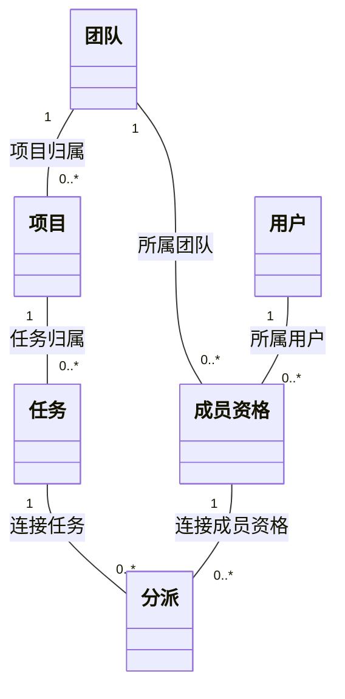

`1` 表示恰好一个，`0..*` 表示零到多个。关系线表达领域关联。

普通关系线之外的约束：

- 每个分派的成员资格所属团队，必须等于其任务所属项目的团队。
- 同一任务与同一成员资格最多有一个分派。
- 用户退出团队只停用成员资格，历史分派仍保留。

团队、项目、任务或用户的删除行为未规定；此图不指定表结构、外键或级联删除。

已提供可编辑 Mermaid 源码，未运行语法检查或实际渲染。
