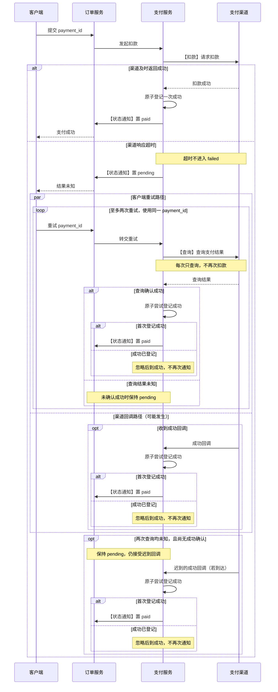
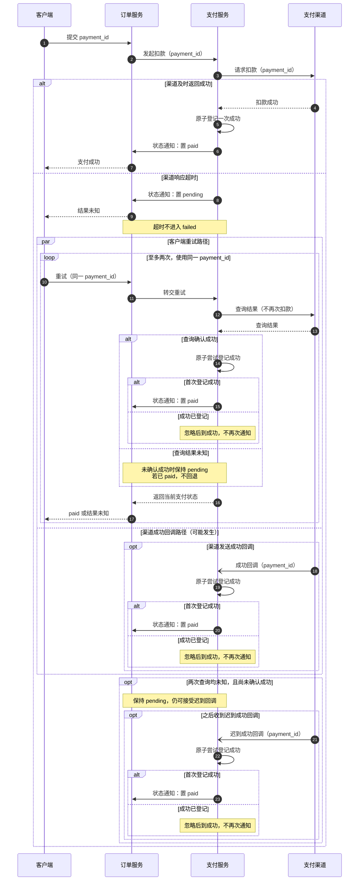
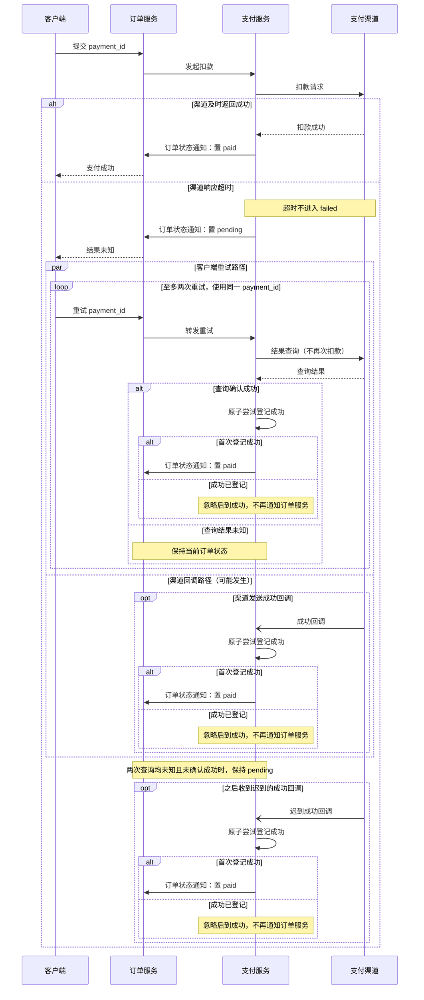
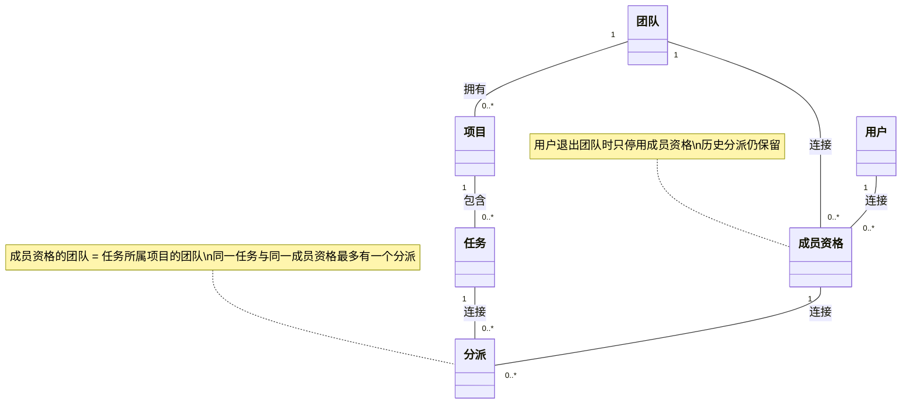
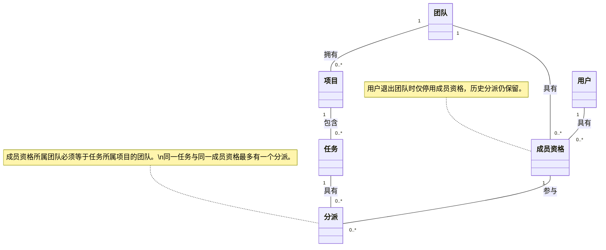
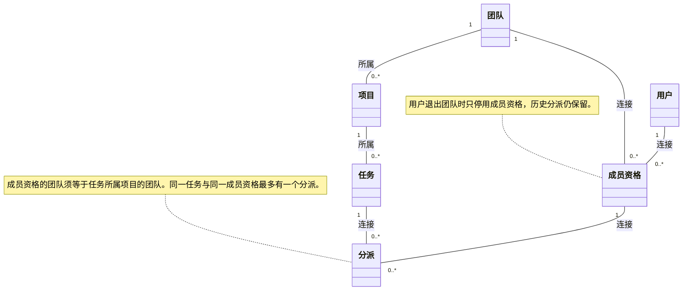

# 容器重测：六份原始输出

每组两份输出。各份在新的容器与CLI会话中生成；Skill与相关参考由测试器直接注入输入。不是自动加载测试。协议、输入、解析结果见[README](README.md)。

## 支付并发与迟到回调

### show-me

[原始文件](outputs/show-me/01-concurrent.md)

`par` 表示重试与回调可并发；两条路径共享同一原子成功登记，只有首次成功触发 `paid` 通知。末尾展示回调晚于两次未知查询到达的情形。

### mermaid-diagrams

[原始文件](outputs/mermaid-diagrams/01-concurrent.md)

查询与回调可并发；原子登记确保仅首次确认成功时通知订单置 `paid`。两次查询均未知且未收到成功回调时，订单保持 `pending`。

### visual-v041

[原始文件](outputs/visual-v041/01-concurrent.md)

查询与回调可并发；谁先原子登记成功，谁触发唯一一次 `paid` 通知。查询未知不会覆盖已确认的 `paid`。未添加明确失败或退款分支；未运行语法检查或实际渲染。

## 领域数量关系与约束

### show-me

[原始文件](outputs/show-me/02-cardinality.md)

线端的 `1` 表示恰好一个，`0..*` 表示零到多个。图中使用普通关系线；跨关系的团队一致性、分派唯一性及退出后的保留规则由注释补充。未规定团队、项目、任务或用户的删除行为。

### mermaid-diagrams

[原始文件](outputs/mermaid-diagrams/02-cardinality.md)

每条线的 `1` 表示另一端的每个实例必须且只关联一个该概念实例；`0..*` 表示可关联零到多个实例。

图中使用普通关联线，不推定生命周期依赖。团队一致性、分派唯一性及退出后的保留规则由注释补充；团队、项目、任务和用户的删除行为均未规定。

### visual-v041

[原始文件](outputs/visual-v041/02-cardinality.md)

端点的 `1` 表示恰好一个，`0..*` 表示零到多个。图中使用普通关联线；跨关系的团队一致性、分派唯一性和退出后的保留规则由注释补充。

未规定删除团队、项目、任务或用户的行为；本图不表示表结构、外键或级联删除设计。Mermaid 源码未进行工具语法检查或实际渲染。
