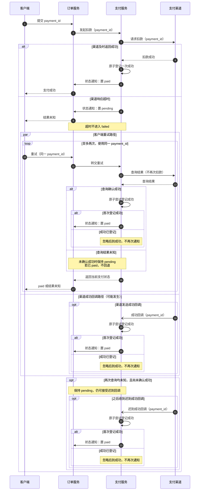

```mermaid
sequenceDiagram
    autonumber
    participant C as 客户端
    participant O as 订单服务
    participant P as 支付服务
    participant G as 支付渠道

    C->>O: 提交 payment_id
    O->>P: 发起扣款（payment_id）
    P->>G: 请求扣款（payment_id）

    alt 渠道及时返回成功
        G-->>P: 扣款成功
        P->>P: 原子登记一次成功
        P->>O: 状态通知：置 paid
        O-->>C: 支付成功
    else 渠道响应超时
        P->>O: 状态通知：置 pending
        O-->>C: 结果未知
        Note over O,P: 超时不进入 failed

        par 客户端重试路径
            loop 至多两次，使用同一 payment_id
                C->>O: 重试（同一 payment_id）
                O->>P: 转交重试
                P->>G: 查询结果（不再次扣款）
                G-->>P: 查询结果
                alt 查询确认成功
                    P->>P: 原子尝试登记成功
                    alt 首次登记成功
                        P->>O: 状态通知：置 paid
                    else 成功已登记
                        Note over P: 忽略后到成功，不再次通知
                    end
                else 查询结果未知
                    Note over O,P: 未确认成功时保持 pending<br/>若已 paid，不回退
                end
                P-->>O: 返回当前支付状态
                O-->>C: paid 或结果未知
            end
        and 渠道成功回调路径（可能发生）
            opt 渠道发送成功回调
                G-)P: 成功回调（payment_id）
                P->>P: 原子尝试登记成功
                alt 首次登记成功
                    P->>O: 状态通知：置 paid
                else 成功已登记
                    Note over P: 忽略后到成功，不再次通知
                end
            end
        end

        opt 两次查询均未知，且尚未确认成功
            Note over O,P: 保持 pending，仍可接受迟到回调
            opt 之后收到迟到成功回调
                G-)P: 迟到成功回调（payment_id）
                P->>P: 原子尝试登记成功
                alt 首次登记成功
                    P->>O: 状态通知：置 paid
                else 成功已登记
                    Note over P: 忽略后到成功，不再次通知
                end
            end
        end
    end
```

查询与回调可并发；原子登记确保仅首次确认成功时通知订单置 `paid`。两次查询均未知且未收到成功回调时，订单保持 `pending`。