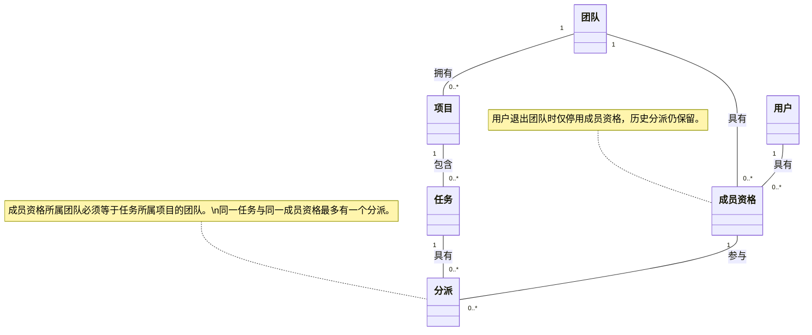

```mermaid
classDiagram
    class 团队
    class 用户
    class 成员资格
    class 项目
    class 任务
    class 分派

    团队 "1" -- "0..*" 成员资格 : 具有
    用户 "1" -- "0..*" 成员资格 : 具有
    团队 "1" -- "0..*" 项目 : 拥有
    项目 "1" -- "0..*" 任务 : 包含
    任务 "1" -- "0..*" 分派 : 具有
    成员资格 "1" -- "0..*" 分派 : 参与

    note for 分派 "成员资格所属团队必须等于任务所属项目的团队。\n同一任务与同一成员资格最多有一个分派。"
    note for 成员资格 "用户退出团队时仅停用成员资格，历史分派仍保留。"
```

每条线的 `1` 表示另一端的每个实例必须且只关联一个该概念实例；`0..*` 表示可关联零到多个实例。

图中使用普通关联线，不推定生命周期依赖。团队一致性、分派唯一性及退出后的保留规则由注释补充；团队、项目、任务和用户的删除行为均未规定。