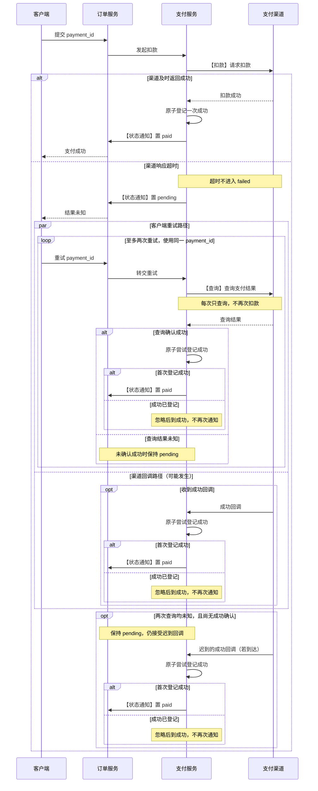

```mermaid
sequenceDiagram
    participant C as 客户端
    participant O as 订单服务
    participant P as 支付服务
    participant G as 支付渠道

    C->>O: 提交 payment_id
    O->>P: 发起扣款
    P->>G: 【扣款】请求扣款

    alt 渠道及时返回成功
        G-->>P: 扣款成功
        P->>P: 原子登记一次成功
        P->>O: 【状态通知】置 paid
        O-->>C: 支付成功
    else 渠道响应超时
        Note over P,G: 超时不进入 failed
        P->>O: 【状态通知】置 pending
        O-->>C: 结果未知

        par 客户端重试路径
            loop 至多两次重试，使用同一 payment_id
                C->>O: 重试 payment_id
                O->>P: 转交重试
                P->>G: 【查询】查询支付结果
                Note over P,G: 每次只查询，不再次扣款
                G-->>P: 查询结果
                alt 查询确认成功
                    P->>P: 原子尝试登记成功
                    alt 首次登记成功
                        P->>O: 【状态通知】置 paid
                    else 成功已登记
                        Note over P: 忽略后到成功，不再次通知
                    end
                else 查询结果未知
                    Note over P,O: 未确认成功时保持 pending
                end
            end
        and 渠道回调路径（可能发生）
            opt 收到成功回调
                G->>P: 成功回调
                P->>P: 原子尝试登记成功
                alt 首次登记成功
                    P->>O: 【状态通知】置 paid
                else 成功已登记
                    Note over P: 忽略后到成功，不再次通知
                end
            end
        end

        opt 两次查询均未知，且尚无成功确认
            Note over O,P: 保持 pending，仍接受迟到回调
            G->>P: 迟到的成功回调（若到达）
            P->>P: 原子尝试登记成功
            alt 首次登记成功
                P->>O: 【状态通知】置 paid
            else 成功已登记
                Note over P: 忽略后到成功，不再次通知
            end
        end
    end
```

`par` 表示重试与回调可并发；两条路径共享同一原子成功登记，只有首次成功触发 `paid` 通知。末尾展示回调晚于两次未知查询到达的情形。