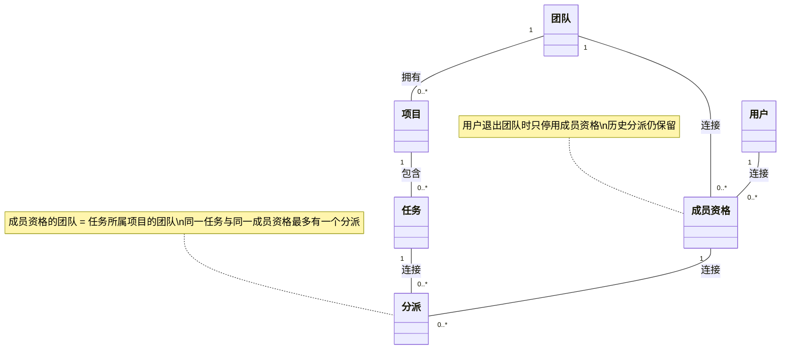

```mermaid
classDiagram
    class 团队
    class 用户
    class 成员资格
    class 项目
    class 任务
    class 分派

    团队 "1" -- "0..*" 成员资格 : 连接
    用户 "1" -- "0..*" 成员资格 : 连接
    团队 "1" -- "0..*" 项目 : 拥有
    项目 "1" -- "0..*" 任务 : 包含
    任务 "1" -- "0..*" 分派 : 连接
    成员资格 "1" -- "0..*" 分派 : 连接

    note for 分派 "成员资格的团队 = 任务所属项目的团队\n同一任务与同一成员资格最多有一个分派"
    note for 成员资格 "用户退出团队时只停用成员资格\n历史分派仍保留"
```

线端的 `1` 表示恰好一个，`0..*` 表示零到多个。图中使用普通关系线；跨关系的团队一致性、分派唯一性及退出后的保留规则由注释补充。未规定团队、项目、任务或用户的删除行为。