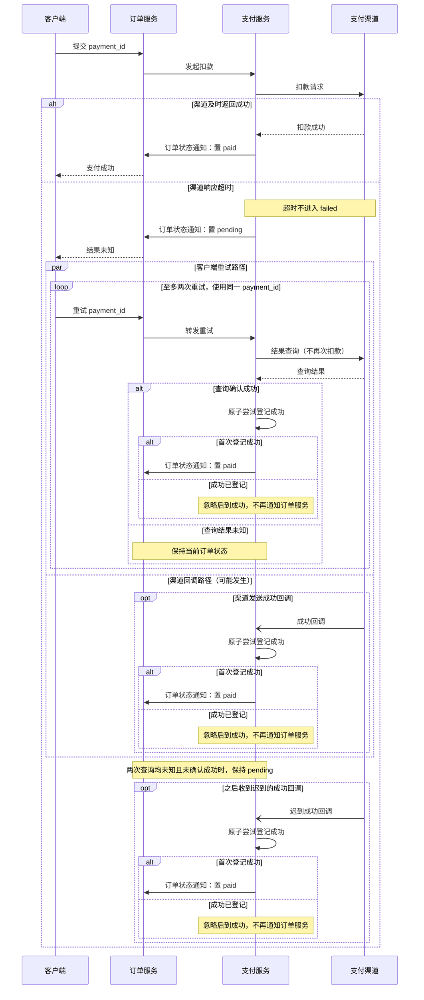

```mermaid
sequenceDiagram
    participant C as 客户端
    participant O as 订单服务
    participant P as 支付服务
    participant G as 支付渠道

    C->>O: 提交 payment_id
    O->>P: 发起扣款
    P->>G: 扣款请求

    alt 渠道及时返回成功
        G-->>P: 扣款成功
        P->>O: 订单状态通知：置 paid
        O-->>C: 支付成功
    else 渠道响应超时
        Note over P,G: 超时不进入 failed
        P->>O: 订单状态通知：置 pending
        O-->>C: 结果未知

        par 客户端重试路径
            loop 至多两次重试，使用同一 payment_id
                C->>O: 重试 payment_id
                O->>P: 转发重试
                P->>G: 结果查询（不再次扣款）
                G-->>P: 查询结果
                alt 查询确认成功
                    P->>P: 原子尝试登记成功
                    alt 首次登记成功
                        P->>O: 订单状态通知：置 paid
                    else 成功已登记
                        Note over P: 忽略后到成功，不再通知订单服务
                    end
                else 查询结果未知
                    Note over P,O: 保持当前订单状态
                end
            end
        and 渠道回调路径（可能发生）
            opt 渠道发送成功回调
                G-)P: 成功回调
                P->>P: 原子尝试登记成功
                alt 首次登记成功
                    P->>O: 订单状态通知：置 paid
                else 成功已登记
                    Note over P: 忽略后到成功，不再通知订单服务
                end
            end
        end

        Note over O,P: 两次查询均未知且未确认成功时，保持 pending
        opt 之后收到迟到的成功回调
            G-)P: 迟到成功回调
            P->>P: 原子尝试登记成功
            alt 首次登记成功
                P->>O: 订单状态通知：置 paid
            else 成功已登记
                Note over P: 忽略后到成功，不再通知订单服务
            end
        end
    end
```

查询与回调可并发；谁先原子登记成功，谁触发唯一一次 `paid` 通知。查询未知不会覆盖已确认的 `paid`。未添加明确失败或退款分支；未运行语法检查或实际渲染。