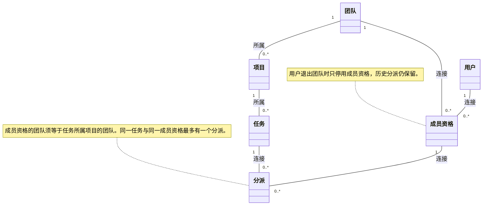

```mermaid
classDiagram
    class Team["团队"]
    class User["用户"]
    class Membership["成员资格"]
    class Project["项目"]
    class Task["任务"]
    class Assignment["分派"]

    Team "1" -- "0..*" Membership : 连接
    User "1" -- "0..*" Membership : 连接
    Team "1" -- "0..*" Project : 所属
    Project "1" -- "0..*" Task : 所属
    Task "1" -- "0..*" Assignment : 连接
    Membership "1" -- "0..*" Assignment : 连接

    note for Assignment "成员资格的团队须等于任务所属项目的团队。同一任务与同一成员资格最多有一个分派。"
    note for Membership "用户退出团队时只停用成员资格，历史分派仍保留。"
```

端点的 `1` 表示恰好一个，`0..*` 表示零到多个。图中使用普通关联线；跨关系的团队一致性、分派唯一性和退出后的保留规则由注释补充。

未规定删除团队、项目、任务或用户的行为；本图不表示表结构、外键或级联删除设计。Mermaid 源码未进行工具语法检查或实际渲染。