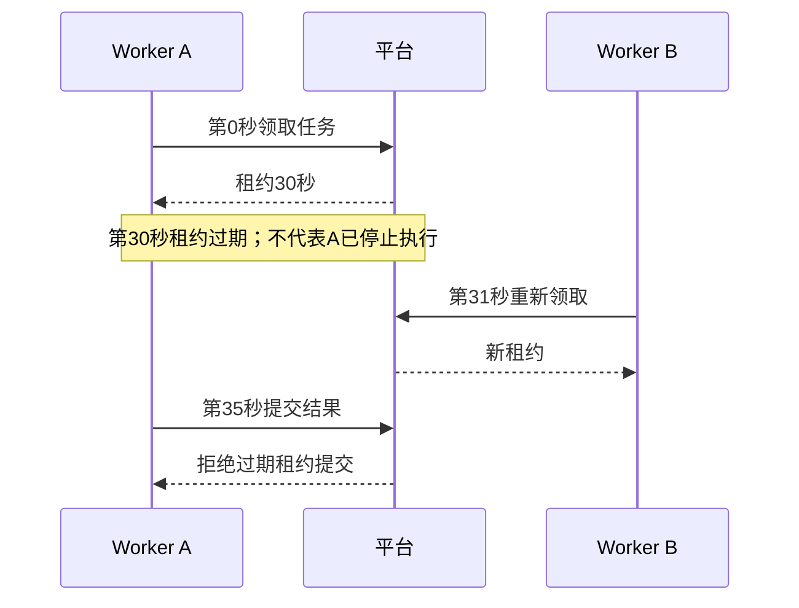

```mermaid
sequenceDiagram
    participant A as Worker A
    participant P as 平台
    participant B as Worker B
    A->>P: 第0秒领取任务
    P-->>A: 租约30秒
    Note over A,P: 第30秒租约过期；不代表A已停止执行
    B->>P: 第31秒重新领取
    P-->>B: 新租约
    A->>P: 第35秒提交结果
    P-->>A: 拒绝过期租约提交
```
未渲染验证。

“任务只执行一次”不成立：重新领取允许B执行，而A过期后未必停止。拒绝A的结果只约束平台提交，不能撤销可能已发生的外部写入。外部幂等或隔离保证未提供，因此不能保证外部副作用只发生一次；也不能据此断言本次已经重复写入。
