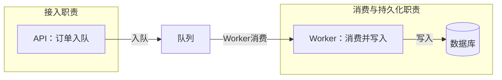

```mermaid
flowchart LR
    subgraph 接入职责
        API[API：订单入队]
    end
    Q[队列]
    subgraph 消费与持久化职责
        W[Worker：消费并写入]
        DB[(数据库)]
    end
    API -->|入队| Q
    Q -->|Worker消费| W
    W -->|写入| DB
```
未渲染验证。

这些关系均由题目提供；ADR另外确认API不直接写数据库。队列为什么被选用尚未确认，不能把提升吞吐、隔离故障当成原设计理由。若需解释取舍，应查原决策记录；当前资料不足以确认这些原因。
