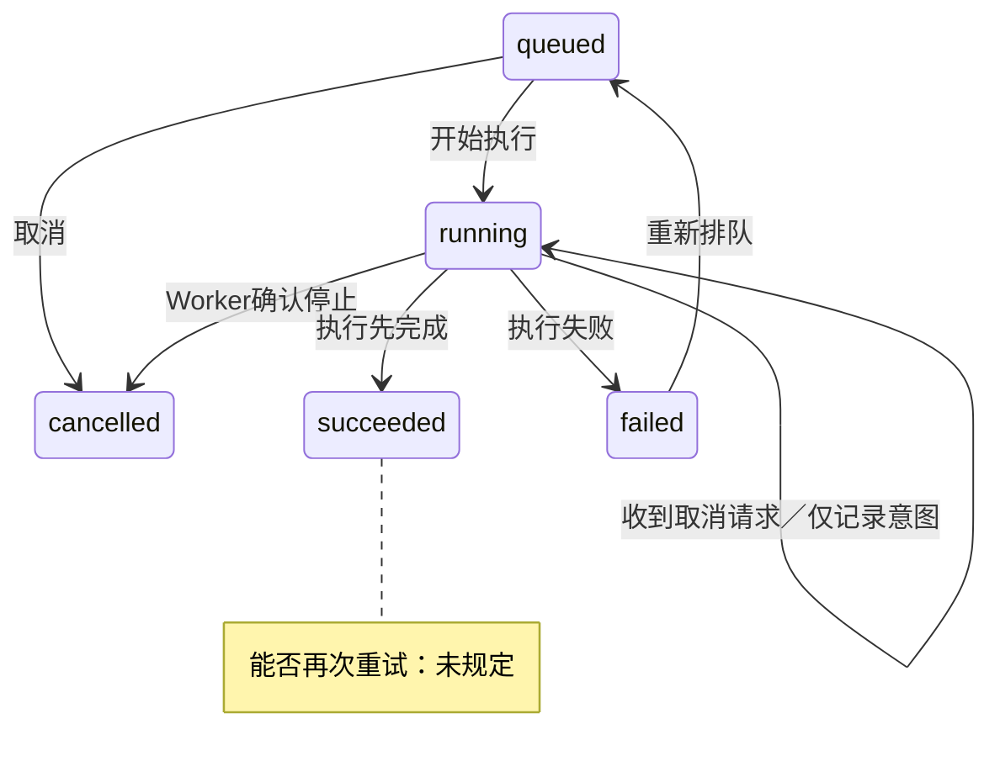

```mermaid
stateDiagram-v2
    queued --> running: 开始执行
    queued --> cancelled: 取消
    running --> running: 收到取消请求／仅记录意图
    running --> cancelled: Worker确认停止
    running --> succeeded: 执行先完成
    running --> failed: 执行失败
    failed --> queued: 重新排队
    note right of succeeded
        能否再次重试：未规定
    end note
```
未渲染验证。开始执行、执行失败两条边按状态名称推断；其余边来自给定规则。

running的取消请求不会立即变成cancelled；只有Worker确认停止才完成取消。若执行先完成，仍可进入succeeded，不能向请求方承诺“请求取消就必然取消”。succeeded的重试规则需要核实，不能画成已支持或已禁止。
