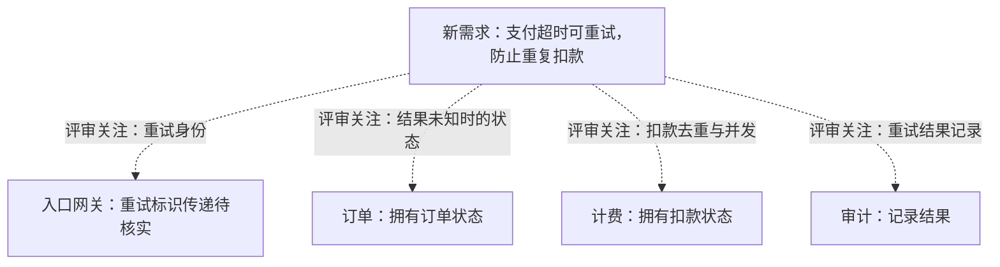

```mermaid
flowchart TB
    R[新需求：支付超时可重试，防止重复扣款]
    G[入口网关：重试标识传递待核实]
    O[订单：拥有订单状态]
    B[计费：拥有扣款状态]
    A[审计：记录结果]
    R -.->|评审关注：重试身份| G
    R -.->|评审关注：结果未知时的状态| O
    R -.->|评审关注：扣款去重与并发| B
    R -.->|评审关注：重试结果记录| A
```
未渲染验证。虚线表达评审关注，未断言模块调用关系。

已知职责如图。超时不证明扣款失败；先核实现有重试/幂等契约，重点查稳定标识、外部扣款边界及并发去重。若机制不足，再决定幂等责任和结果未知时的处理方案。需要验证并发重试、扣款后崩溃等场景能否避免重复扣款，并保持订单与审计结果一致。
