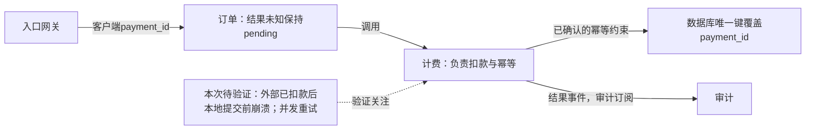

```mermaid
flowchart LR
    G[入口网关] -->|客户端payment_id| O[订单：结果未知保持pending]
    O -->|调用| B[计费：负责扣款与幂等]
    B -->|已确认的幂等约束| U[数据库唯一键覆盖payment_id]
    B -->|结果事件，审计订阅| A[审计]
    T[本次待验证：外部已扣款后本地提交前崩溃；并发重试]
    T -.->|验证关注| B
```
未渲染验证。实线来自已有设计记录，虚线标本次验证范围。

本次沿用已确认机制，补齐两类测试证据：崩溃恢复后重试是否再次产生外部扣款，以及同一payment_id并发重试能否收敛为一次扣款和一致结果。检查结果未知时订单维持pending、结果事件及审计记录与最终结果一致。数据库唯一键已存在，但单凭它不能证明跨外部扣款边界的正确性；若测试暴露缺口，再针对失败点修正。
