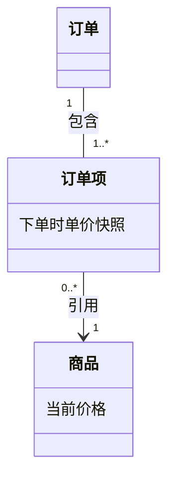

```mermaid
classDiagram
    订单 "1" -- "1..*" 订单项 : 包含
    订单项 "0..*" --> "1" 商品 : 引用
    class 订单项 {
        下单时单价快照
    }
    class 商品 {
        当前价格
    }
```
未渲染验证。这是领域关系，不表示已有表或外键。

每个订单至少有一个订单项，每个订单项只属于一个订单并引用一个商品；一个商品可以没有订单项引用，也可以被多个订单项引用。订单项单价是下单时的历史快照，商品当前价格变化不能改写它。表结构、外键、级联删除和ORM方案均未给出，不能从这些领域关系推出实现。
