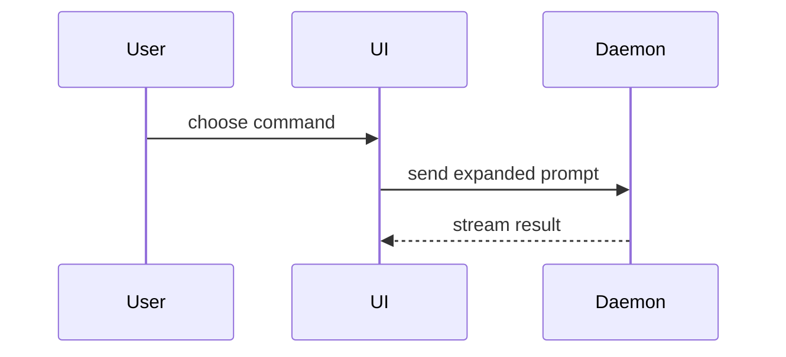

# 图优先的工程解释

以下本地规则补充 show-me 原文；有冲突时以本地规则为准。后面的上游正文完整保留，便于核对和更新。

## 本地规则

1. **主动选择，图先于文字。** 用户描述目标即可，不需记住绘图 Skill。默认简短中文，保留代码标识符。选择足以解释当前问题的视图，在相关位置突出影响判断的关键关系、条件或风险；其他细节用必要的短文补充，不要求图独立承载全部答案。“最小”指省去无关信息，复杂问题仍需展开关键接口、约束、时序和失败路径。按需读取 [工程视图指引](references/design-views.md)，按问题和读者所需深度展开，而不是按阶段套用固定图集。这是一项表达能力，图示完成后让调用者继续原任务。
2. **关系与未知项有依据。** 图中的每条关系都要有输入/代码/设计记录依据，或明确标为推断、建议或评审关注；仅有模块职责不能推出调用链。代码现状不能证明设计原因。先核对与当前问题有关的已有资料，再区分待核实、待验证、待决策和建议；输入未提供不等于系统没有方案。复杂未知项按需读取 [未知项与关系规则](references/uncertainty.md)，合并成少量当前关键问题，不把每项都变成人的待办。检查必然性/仅一次等断言的反例，同步修正图文；触发不等于完成。
3. **检查表达和渲染。** 箭头、分组、标签明确关系、边界和确认状态，不能只靠颜色。前后图保持术语和抽象层次一致，图文中的主体、行为与所有权须符合依据；正文不逐项复述图。有工具时渲染并检查显示；没有时对需渲染的图简短注明“未渲染验证”，伪代码、diff 和普通文本无需此提示。渲染成功不证明语义正确。上游的打开 HTML 步骤仅在环境支持且已获授权时执行；否则交付文件位置与查看方式。简单 Mermaid 图无需强制生成 HTML 或重复文本图。
4. **按知识价值保存。** 代码能恢复的关系图默认会话展示，需要文件则临时交付；承载设计意图、约束和取舍的图随已有设计记录/ADR 保存，引用权威来源。按任务已有授权落盘，不额外要求重复确认。长期图注明来源、核对版本、现状/目标/草稿状态及重审条件；未知项直说未知。临时交接引用已有图，不复制平行知识库。改变决策留下理由，不能静默覆盖。

## 调用绘图能力

若当前环境提供可由模型/流程调用的 `mermaid-diagrams`，可委托其生成或校验 Mermaid；其他可用绘图能力同理。先核对描述、调用限制和工具依赖，不按名称假定能力。未安装时直接生成图，不中断任务。保留设计问题、关键语义、来源与假设，委托绘图不等于委托决策。

`architecture-report` 仅在需要组织多张图及设计说明时使用，避免为局部问题生成整份报告。上游 show-me 的用户触发限制不复制到本 Skill；实际自动匹配仍取决于客户端。绘图完成返回视图/文件和必要的简短说明；来源、未知项和验证状态集中展示，已有明确依据无需反复复述。默认保存策略在执行产生文件或持久修改时再说明，不给每次解释附例行流程说明。

## show-me 上游正文（完整保留）

Help the user understand the current topic of conversation visually. Skip the preamble and keep prose brief. Pick the smallest view that makes the key point clear.

- Show logic or an algorithm as pseudocode:

```text
on(save)
  if content is unchanged
    return cached result
  write new content
  return fresh result
```

- Show runtime control flow as a call tree:

```text
submitForm
  createSession
    persistPrompt
    launchAgent
  navigateToSession
```

- Show UI structure as a component tree, including state and module boundaries that matter:

```tsx
<SessionPage> (apps/example/src/routes/session.tsx)
  useSessionEvents()
  <SessionToolbar>
    <RunSkillButton> (packages/ui)
```

- Show file responsibility or a broad refactor as a shallow file tree:

```text
src/
├── commands/       # parses user actions
├── sessions/       # owns session state
└── transport/      # sends API requests
```

- Show component interaction, control flow, or data flow with Mermaid:



- Use `diff` when the point is what changes and the surrounding shape already exists. Match the diff shape to the topic.

For a component change:

```diff
 <SessionPage>
   useSessionEvents()
   <SessionToolbar>
+    <RunSkillButton />
   <SessionTimeline>
+    <SkillResultCard />
```

For a file-layout change:

```diff
 src/
 ├── commands/
+│   └── show-me.ts       # expands the slash command
 ├── sessions/
-└── transport.ts
+└── transport/
+    ├── client.ts
+    └── stream.ts
```

For a call-tree or call-stack change:

```diff
 submitForm
   createSession
     persistPrompt
+    expandSkillMention
     launchAgent
-  navigateToSession
+  navigateToSession
+    subscribeToEvents
```

For a state or control-flow change:

```diff
 on(save)
-  write content
+  if content is unchanged
+    return cached result
+  write new content
+  invalidate cache
```

- Show the whole block when most of it is new, when omitted context would hide ownership or order, or when the user needs a copyable target shape:

```ts
function expandSkill(command: string): string {
  const skillName = command.slice(1)
  return `use the ${skillName} skill`
}
```

- For a visual UI, layout, state comparison, or concept too dense for Mermaid, write one focused HTML file — a diagram, an infographic, or a short slide deck, whichever fits the point. Match the product's colors, type, spacing, and components; use real labels and data; support desktop and mobile. Then open it for the user:

```
Bash(open path/to/show-me-{description}.html)
```

### guidance

Place each visual next to the short text it supports. Keep only the calls, files, props, states, and boundaries needed to answer the user's current question or the options to resolve the current discussion point.

You may use one of these, you may use several, it is unlikely you will use all of them. Use your judgement and don't overwhelm the user.
