# 新增四题：第一轮五组独立生成对照

逐字汇集未改写的原始文件；语法解析与事实审阅见 [主报告](README.md)。显示效果取决于阅读平台，本轮未验证布局。

## 07-incident

一次请求在10:00命中API缓存并返回价格100元；10:01数据库价格改为120元，更新事件成功写入队列；10:02消费者报告该事件处理失败，随后没有提供重试或缓存失效记录；10:03请求仍从缓存读到100元。缓存TTL为10分钟。请用图解释已知过程、候选原因和下一步排查，不把时间先后当作已证明的因果。简短中文，不写项目文档。

### show-me

[原文件](outputs/show-me/07-incident.md)

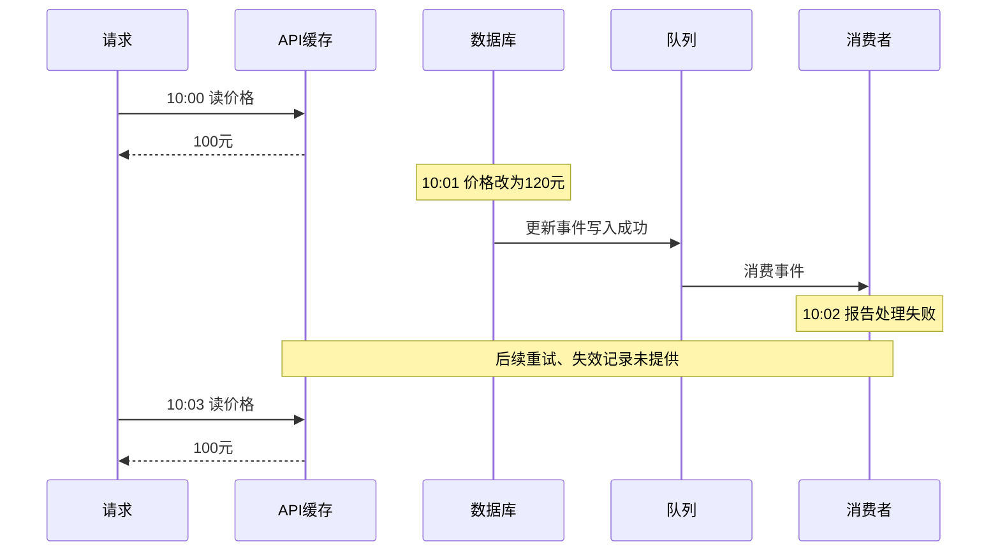

候选原因：处理失败可能阻断失效；也可能失效了错误的键或实例，或旧值被再次写入。时间顺序不能证明哪一种发生了。

下一步：按事件ID查失败阶段、重试/死信和失效记录，再核对缓存键、实例、写入时间及实际TTL。TTL为10分钟，但10:00只是命中时间，不能据此推算何时过期。


### mermaid-diagrams

[原文件](outputs/mermaid-diagrams/07-incident.md)

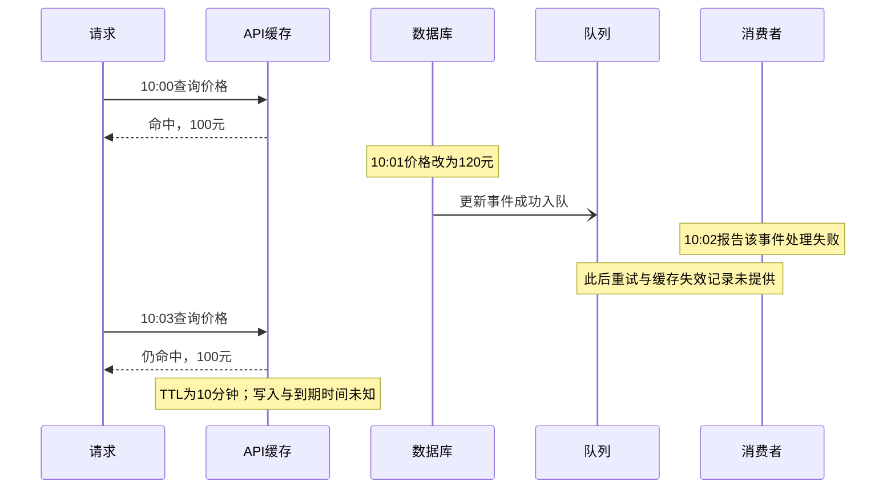

候选原因是事件处理失败导致失效未执行、重试尚未成功，或失效键不匹配、旧值被重新写入；均未证实。TTL允许旧值暂存，但不能从10:00命中推定到期为10:10。

下一步按事件ID查失败位置、确认与重试记录，再核对缓存键、失效执行、写入时间和剩余TTL。时间先后本身不能证明消费者失败导致此次旧值命中。


### visual-v030

[原文件](outputs/visual-v030/07-incident.md)

```text
已知时间线
10:00  请求 → API缓存命中 → 返回100元
10:01  数据库价格改为120元；更新事件成功入队
10:02  消费者报告该事件处理失败
        后续重试、缓存失效记录：未提供
10:03  请求 → API缓存命中 → 仍返回100元
约束：缓存TTL为10分钟；缓存实际写入时间未知

候选解释                         验证证据
失效处理失败且未成功补偿       → 消费错误、重试/死信及失效日志
失效键或缓存层不匹配           → 事件标识、目标键、请求实际命中层
失效后被旧值重新填充           → 删除、写入及读取来源的时间记录
```

消费者失败是线索，尚不能证明它导致10:03的旧值。TTL也不从10:00命中时重新起算；先串联该事件、实际缓存键的处理/写入日志，并查实际到期时间，定位旧值保留或回填的路径。


### visual-v031

[原文件](outputs/visual-v031/07-incident.md)

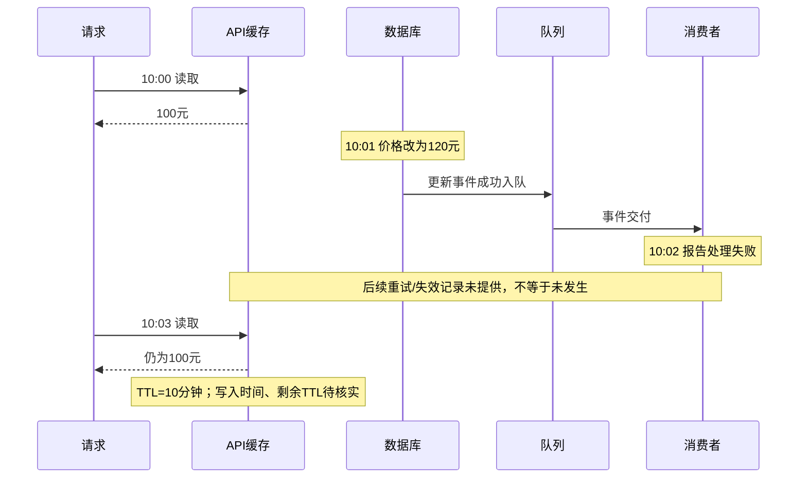

候选原因是事件失败后失效未完成，或重试/失效命中了错误键；时间顺序还不能证明因果。建议沿同一事件ID查失败步骤、确认及重试/死信记录，再核对缓存键、失效日志、写入时间和实际TTL。10:00命中不代表此时刚写入，不能据此推定10:10过期。

未渲染验证。


### visual-v032-candidate

[原文件](outputs/visual-v032-candidate/07-incident.md)

```text
时间     已知观测
10:00    API命中缓存，返回100元
10:01    数据库改为120元；更新事件成功入队
10:02    消费者报告事件处理失败
         └─ 后续重试、缓存失效：未提供记录
10:03    API仍命中缓存，返回100元

候选原因（未证实）             建议验证
事件未成功完成失效 ─────────→ 查事件ID、失败阶段、重试/死信及失效记录
失效作用于错误键或缓存层 ───→ 比对写入、失效、读取的键与实例
失效后又写回旧值 ───────────→ 查失效前后缓存写入与并发请求轨迹
```

时间先后不能证明消费失败导致旧价；失败也不等于失效步骤未执行。TTL为10分钟，但缓存创建时间、是否续期未知；若10:00才写入且不续期，10:03仍可在有效期内。先串联同一事件及缓存键的日志，再用复现验证候选原因。


## 08-tradeoff

团队要为报表选择实时查询主库或异步物化视图。已有约束：用户能接受最多5分钟的数据延迟，主库在业务高峰接近容量上限，团队只有两名维护者。实时查询不需新增同步链路；物化视图需要处理积压、重放和对账。没有负载测试、报表查询成本和运维成本数据。请用图帮助比较这两个方案，给出有条件的建议与所需证据，不把候选方案当成已决定。简短中文，不写项目文档。

### show-me

[原文件](outputs/show-me/08-tradeoff.md)

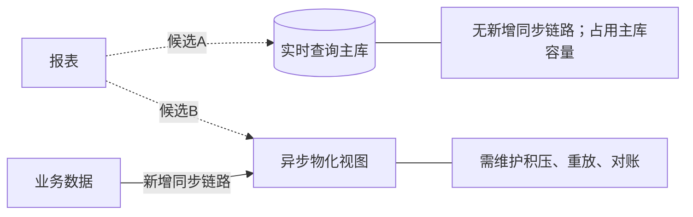

| 比较点 | 实时主库 | 异步物化视图 |
|---|---|---|
| 数据延迟 | 查询当前数据 | 必须控制在5分钟内 |
| 高峰容量 | 主库接近上限，需证明承载能力 | 可分担查询，仍需量化同步开销 |
| 两人维护 | 链路较少 | 额外运维负担需评估 |

有条件地优先验证物化视图：若能满足5分钟延迟且两人能维护，较适合缓解高峰压力。若报表实测开销很小、主库仍有安全余量，实时查询也可成立。

决策前需要：报表成本与高峰负载测试、物化视图积压恢复时间、重放/对账演练及维护成本。两者目前都是候选。


### mermaid-diagrams

[原文件](outputs/mermaid-diagrams/08-tradeoff.md)

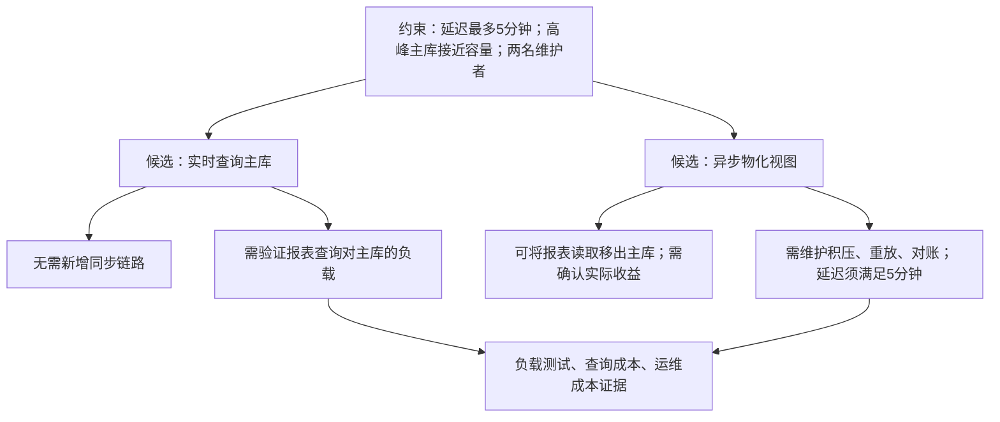

倾向先验证物化视图：若同步与回放负载可控、积压恢复仍满足5分钟且两人能维护，则采用。若实测实时查询足够轻、主库仍有安全余量，则实时方案更省维护。当前缺少成本与测试数据，两种方案都尚未决定。


### visual-v030

[原文件](outputs/visual-v030/08-tradeoff.md)

```text
候选A：实时查询主库             候选B：异步物化视图
报表 → 主库实时查询            主库变更 → 异步同步 → 物化视图 ← 报表
       ↑高峰接近容量上限                   ↑积压、重放、对账
无需新增同步链路               须验证数据延迟≤5分钟
两名维护者：新增链路的维护负担需要量化
```

建议先验证B：允许5分钟延迟且主库接近容量，使它更值得评估，但同步链路也可能增加主库负载和维护成本，尚未决定。

决策证据集中在两组：真实报表查询的高峰压测与成本；物化方案的端到端延迟、积压恢复/重放/对账演练及维护工时。若A在高峰仍有足够容量且成本低，可选A；若B满足延迟、减轻总负载且两人能维护，可选B。两者均不满足时继续调整范围或方案。


### visual-v031

[原文件](outputs/visual-v031/08-tradeoff.md)

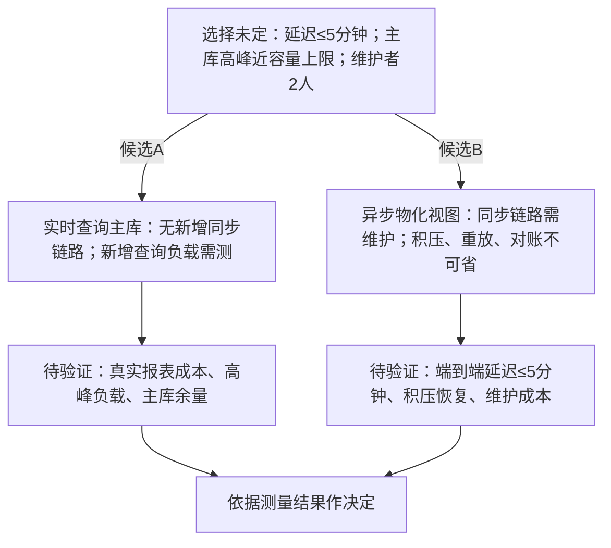

建议优先验证物化视图，因可接受延迟且主库余量紧张；前提是它能减少主库压力，并由两人维持延迟与恢复目标。若报表成本很低、实测主库有余量，而同步运维负担过高，则实时查询更合适。先以代表性报表做高峰负载测试，再测同步积压、重放及对账成本，当前证据不足以定案。

未渲染验证。


### visual-v032-candidate

[原文件](outputs/visual-v032-candidate/08-tradeoff.md)

```text
候选A：报表 ──实时查询──→ 主库
                         ↑ 高峰接近容量上限
       优点：无新增同步链路
       关键未知：报表查询增加多少负载？

候选B：数据更新 ──异步同步──→ 物化视图 ←──查询── 报表
                  ↑                 ↑
       积压、重放、对账       端到端延迟须≤5分钟
       关键未知：两名维护者能否承担运维？
```

| 比较点 | 实时查询主库 | 异步物化视图 |
|---|---|---|
| 时效 | 直接查询当前数据 | 需证明延迟不超过5分钟 |
| 主库压力 | 增加报表查询负载 | 可转移报表查询，但同步仍有成本 |
| 维护成本 | 少一条同步链路 | 需维护积压、重放和对账 |

建议优先验证物化视图候选：延迟容忍度与主库压力支持这一方向，但两名维护者是约束。需测报表查询成本及高峰主库余量、同步峰值与积压恢复时间，并演练重放/对账、估算维护投入。若主库能安全承载且同步维护成本过高，可选实时查询；证据不足前不定案。


## 09-domain

业务规则：一个订单包含一个或多个订单项；每个订单项属于且只属于一个订单；每个订单项引用一个商品，同一商品可被多个订单项引用，商品可以从未被下单。订单项保存下单时的单价快照；商品当前价格变化不能改写历史订单项价格。还没有数据库表、外键、级联删除或ORM设计。请用图解释领域关系、数量关系和价格约束，不将领域规则写成已有数据库实现。简短中文，不写项目文档。

### show-me

[原文件](outputs/show-me/09-domain.md)

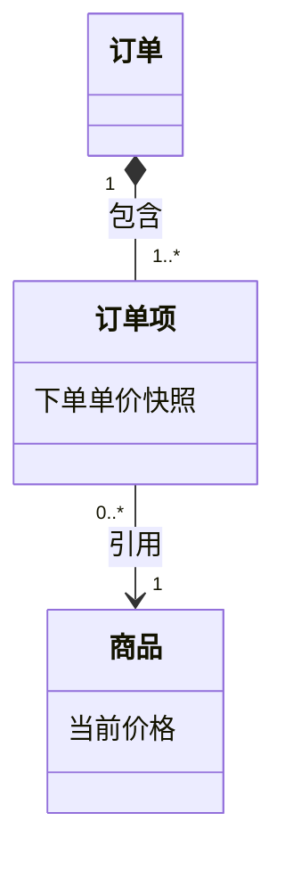

每个订单至少有一个订单项；每个订单项只属于一个订单，并引用一个商品。一个商品可以被零个或多个订单项引用。

订单项使用下单时的单价快照；商品当前价格变化不能改写历史快照。图表达领域归属与引用，不规定表、外键、级联删除或ORM实现。


### mermaid-diagrams

[原文件](outputs/mermaid-diagrams/09-domain.md)

```mermaid
classDiagram
    class Order[订单]
    class Item[订单项] {
        下单单价快照
    }
    class Product[商品] {
        当前价格
    }
    Order "1" -- "1..*" Item : 包含
    Item "0..*" --> "1" Product : 引用
    note for Item "商品当前价格变化，不得改写下单单价快照"
```

每个订单至少有一个订单项，每项只属于一个订单；每项引用一个商品，商品可以被零个或多个订单项引用。历史单价以订单项快照为准。图表达领域规则，表结构、外键、级联删除与ORM映射尚未设计。


### visual-v030

[原文件](outputs/visual-v030/09-domain.md)

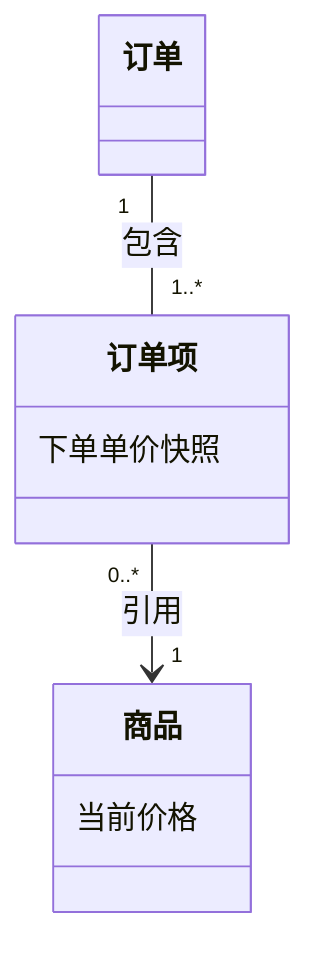

这是领域关系：每个订单有至少一个订单项，每项只属于一个订单且引用一个商品；商品可被零个或多个订单项引用。订单项单价保存下单时快照，商品当前价格变化不得改写历史快照。

图未决定数据库表、外键、级联删除或ORM实现。

未渲染验证。


### visual-v031

[原文件](outputs/visual-v031/09-domain.md)

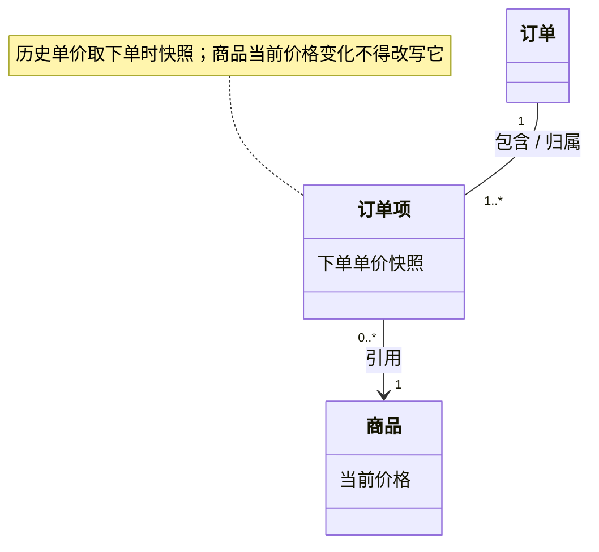

这是领域关系：每项只属一个订单、引用一个商品；商品可被零到多个订单项引用。单价快照与当前价格是两个不同语义的值。图不规定数据库表、外键、级联删除或ORM实现，这些尚未设计。

未渲染验证。


### visual-v032-candidate

[原文件](outputs/visual-v032-candidate/09-domain.md)

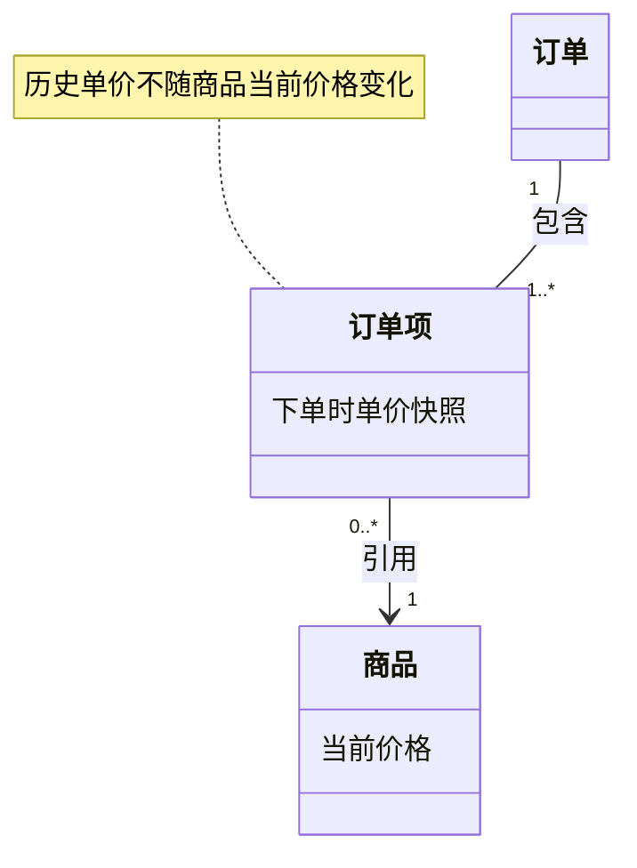

这是领域关系：订单至少有一个订单项，每项只属于一个订单、引用一个商品；商品可以没有订单项引用。下单时保存单价快照，之后商品调价不能改写历史价格。数据库表、外键、级联删除及ORM映射尚未设计，图中不作实现承诺。未渲染验证。


## 10-rollout

当前v1服务读写users.name。计划v2使用users.display_name，发布期间v1与v2实例会并存，v1不会写display_name。拟议步骤是新增可空display_name、回填历史值、切换v2、删除name；没有决定并存期间如何同步两字段。请用图审阅发布与回滚风险，指出什么时候能删除name以及还缺哪些条件。不替团队假定已有双写方案，简短中文，不写项目文档。

### show-me

[原文件](outputs/show-me/10-rollout.md)

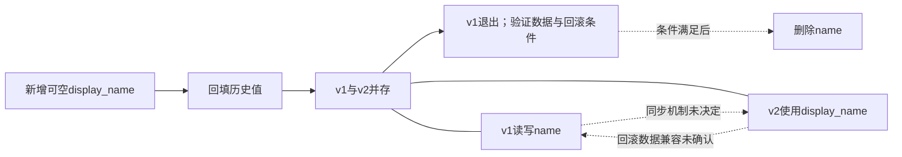

回填只覆盖历史时点：并存期间v1新增或修改name，display_name可能为空或过时；v2更新若未同步回name，回滚到v1也可能读到旧值。

还缺：两字段的权威值、同步方式与冲突规则，v2遇到空值的行为，回填期间并发写入的处理，以及并存和回滚测试。不能假定已有双写。

只有v1及其他name读写方全部退出、数据完整一致、同步迁移验证通过，且不再需要直接回滚到依赖name的版本（或已有验证过的恢复方案），才能删除name。


### mermaid-diagrams

[原文件](outputs/mermaid-diagrams/10-rollout.md)

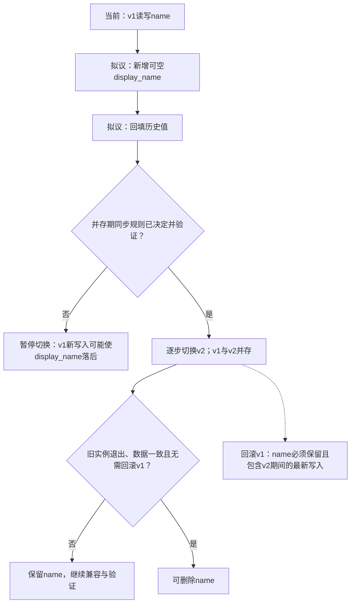

一次回填不能覆盖并存期v1持续写入。还需决定字段同步、冲突处理、v2遇到空值的行为，并验证并发写入及回滚时的数据一致性；不能假定已有双写。

只有所有依赖name的实例与任务退出、display_name完整且一致、v1回滚窗口关闭后，才能删除name；否则回滚可能读到旧值，删列后v1甚至无法运行。


### visual-v030

[原文件](outputs/visual-v030/10-rollout.md)

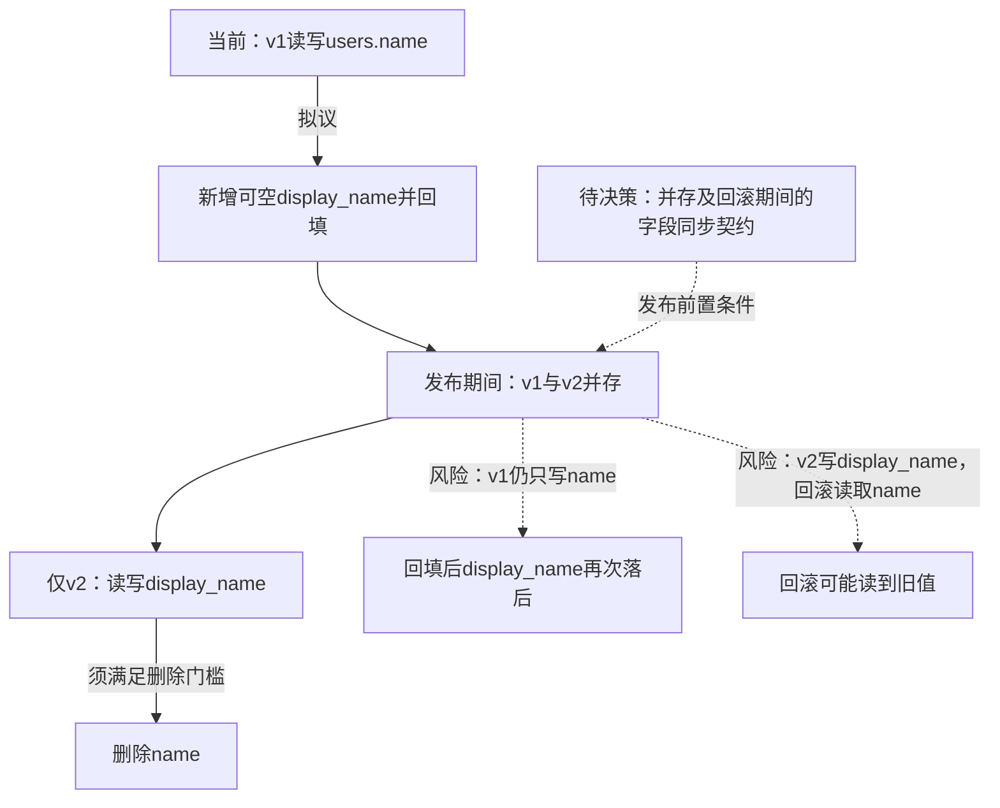

一次回填不能覆盖之后的v1写入，新增字段可空也不能保证v2读到有效值。先决定同步方向、冲突/空值处理、回填与并发写入的衔接，以及回滚时如何保留v2的新数据；当前不能假定双写已存在。

删除name前须确认：v1及其他读写name的依赖全部退出，历史与增量数据已对账，新路径和并发/回滚场景验证通过，并已结束回滚到依赖name版本的窗口，或建立验证过的恢复方案。仍需回滚到v1时保留name及有效同步能力。

未渲染验证。


### visual-v031

[原文件](outputs/visual-v031/10-rollout.md)

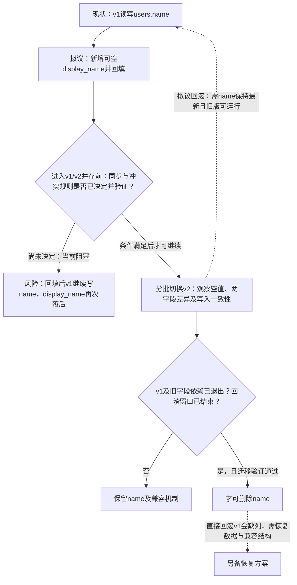

回填只是历史快照，不能解决并存期写入。需决定两字段同步、权威值与冲突规则，并明确v2读取空值的行为；不能假定已有双写。用并发更新、回填期间写入和实际回滚演练验证一致性。只有旧实例与依赖全部退出、display_name完整且最新、旧版回滚需求结束后，才进入删列步骤；否则必须保留name。

图中流程是建议的发布门槛，并非已完成部署。未渲染验证。


### visual-v032-candidate

[原文件](outputs/visual-v032-candidate/10-rollout.md)

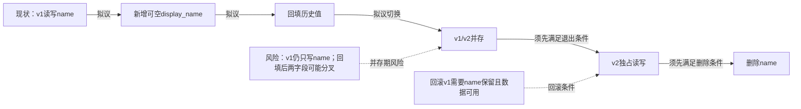

回填只是某时点的数据复制，不能覆盖之后的v1写入；当前拟议步骤缺少并存期同步决定，直接切换可能让v2读到空值或旧值。v2的新写入若未同步name，回滚v1也可能读到旧值。

先决定两字段的写入权威、同步方式、冲突处理及v2空值读取策略，再验证并发写、回填期间更新与回滚的数据一致性。仅在v1及其他name依赖全部退出、同步与迁移核对通过、回滚窗口结束或替代恢复方案验证完成后，才可删除name；删列后不能直接回滚v1。未渲染验证。

