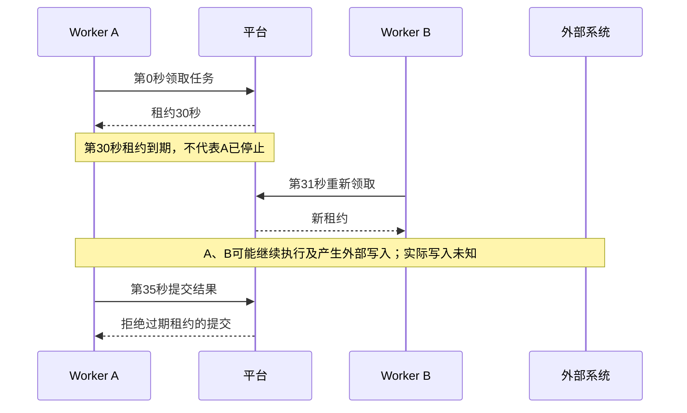

```mermaid
sequenceDiagram
    participant A as Worker A
    participant P as 平台
    participant B as Worker B
    participant E as 外部系统
    A->>P: 第0秒领取任务
    P-->>A: 租约30秒
    Note over A,P: 第30秒租约到期，不代表A已停止
    B->>P: 第31秒重新领取
    P-->>B: 新租约
    Note over A,E: A、B可能继续执行及产生外部写入；实际写入未知
    A->>P: 第35秒提交结果
    P-->>A: 拒绝过期租约的提交
```

“任务只执行一次”不成立为保证：同一任务已被重新领取，可能重复执行。平台拒绝A的结果，只约束结果提交，不能证明外部副作用只发生一次；还需外部写入的幂等或隔离保证。
