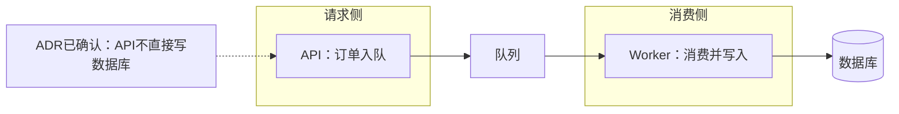

```mermaid
flowchart LR
    subgraph Request[请求侧]
        API[API：订单入队]
    end
    Q[队列]
    subgraph Work[消费侧]
        W[Worker：消费并写入]
    end
    DB[(数据库)]
    API --> Q --> W --> DB
    ADR[ADR已确认：API不直接写数据库]
    ADR -.-> API
```

事实是上述职责与调用路径。选择队列是否为了吞吐、故障隔离或其他目标，尚未确认；不能从“API不直接写库”推导这些设计原因，需补充决策记录或指标证据。
