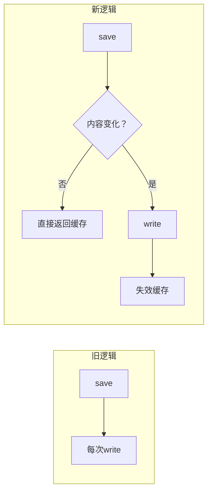

```mermaid
flowchart LR
    subgraph Old[旧逻辑]
        O[save] --> OW[每次write]
    end
    subgraph New[新逻辑]
        N[save] --> C{内容变化？}
        C -->|否| R[直接返回缓存]
        C -->|是| W[write] --> I[失效缓存]
    end
```

改动是增加“内容是否变化”的判断：未变化跳过写入并返回缓存；变化时先写入，再失效缓存。
