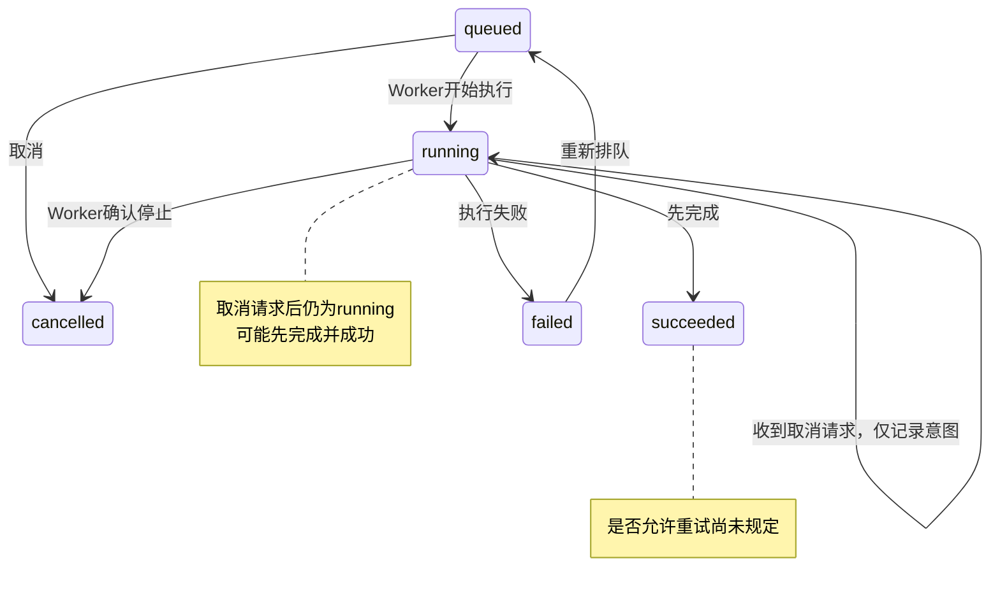

```mermaid
stateDiagram-v2
    queued --> running: Worker开始执行
    queued --> cancelled: 取消
    running --> running: 收到取消请求，仅记录意图
    running --> cancelled: Worker确认停止
    running --> succeeded: 先完成
    running --> failed: 执行失败
    failed --> queued: 重新排队
    note right of running
        取消请求后仍为running
        可能先完成并成功
    end note
    note right of succeeded
        是否允许重试尚未规定
    end note
```

取消请求表示“希望停止”，取消完成表示“Worker已确认停止”。两者之间任务仍在运行，不能提前标记 cancelled；成功后的重试关系需另行明确。
