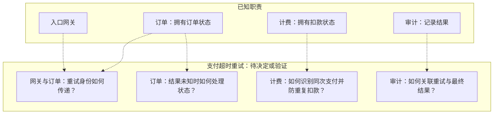

```mermaid
flowchart TB
    subgraph Known[已知职责]
        G[入口网关]
        O[订单：拥有订单状态]
        B[计费：拥有扣款状态]
        A[审计：记录结果]
    end
    subgraph Review[支付超时重试：待决定或验证]
        ID[网关与订单：重试身份如何传递？]
        OS[订单：结果未知时如何处理状态？]
        BS[计费：如何识别同次支付并防重复扣款？]
        AS[审计：如何关联重试与最终结果？]
    end
    G -.-> ID
    O -.-> ID
    O -.-> OS
    B -.-> BS
    A -.-> AS
```

虚线表示评审影响，不代表已有调用路径或幂等方案。优先明确支付身份、幂等责任及原子性边界，再验证并发重试、超时后实际已扣款、崩溃恢复时是否仍只扣一次；订单与审计需一致反映最终结果。
