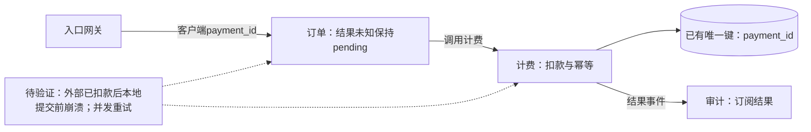

```mermaid
flowchart LR
    G[入口网关] -->|客户端payment_id| O[订单：结果未知保持pending]
    O -->|调用计费| B[计费：扣款与幂等]
    B --> D[(已有唯一键：payment_id)]
    B -->|结果事件| A[审计：订阅结果]
    T[待验证：外部已扣款后本地提交前崩溃；并发重试]
    T -.-> B
    T -.-> O
```

职责、payment_id传递和唯一键机制已确认，本次应沿用并补充上述两类测试，检查实际扣款次数、恢复后的结果、订单状态及审计事件一致性。唯一键约束本地记录，并不能单凭它证明外部扣款在崩溃窗口也不会重复；需测试与实现证据。
