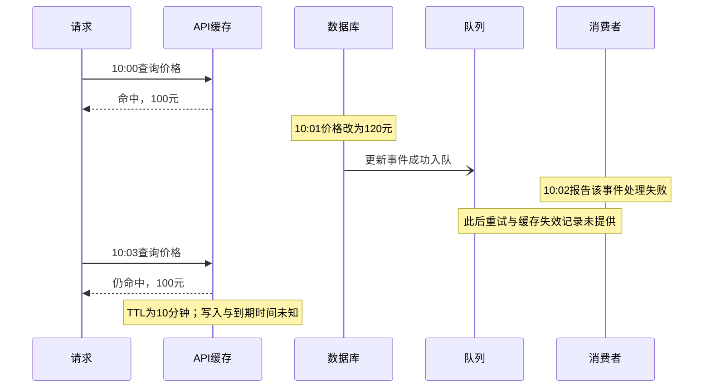

```mermaid
sequenceDiagram
    participant R as 请求
    participant C as API缓存
    participant D as 数据库
    participant Q as 队列
    participant W as 消费者
    R->>C: 10:00查询价格
    C-->>R: 命中，100元
    Note over D: 10:01价格改为120元
    D-)Q: 更新事件成功入队
    Note over W: 10:02报告该事件处理失败
    Note over Q,W: 此后重试与缓存失效记录未提供
    R->>C: 10:03查询价格
    C-->>R: 仍命中，100元
    Note over C: TTL为10分钟；写入与到期时间未知
```

候选原因是事件处理失败导致失效未执行、重试尚未成功，或失效键不匹配、旧值被重新写入；均未证实。TTL允许旧值暂存，但不能从10:00命中推定到期为10:10。

下一步按事件ID查失败位置、确认与重试记录，再核对缓存键、失效执行、写入时间和剩余TTL。时间先后本身不能证明消费者失败导致此次旧值命中。
