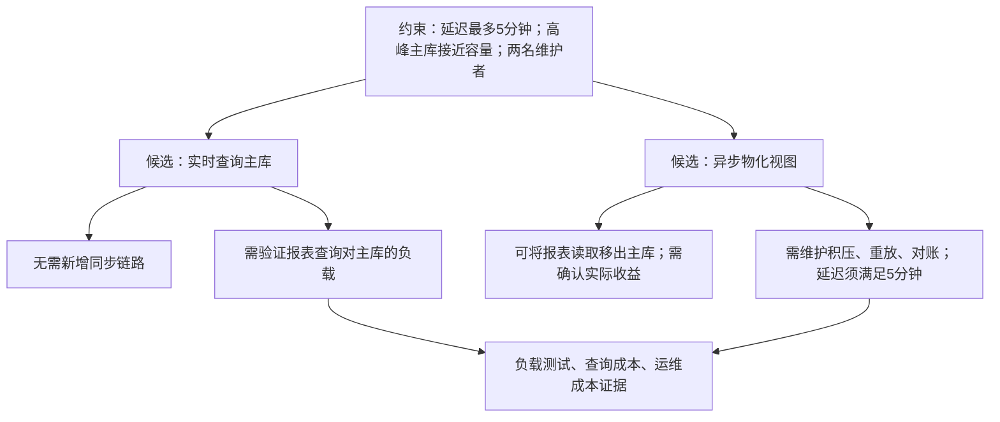

```mermaid
flowchart TB
    C[约束：延迟最多5分钟；高峰主库接近容量；两名维护者]
    C --> R[候选：实时查询主库]
    C --> M[候选：异步物化视图]
    R --> RP[无需新增同步链路]
    R --> RR[需验证报表查询对主库的负载]
    M --> MP[可将报表读取移出主库；需确认实际收益]
    M --> MR[需维护积压、重放、对账；延迟须满足5分钟]
    RR --> E[负载测试、查询成本、运维成本证据]
    MR --> E
```

倾向先验证物化视图：若同步与回放负载可控、积压恢复仍满足5分钟且两人能维护，则采用。若实测实时查询足够轻、主库仍有安全余量，则实时方案更省维护。当前缺少成本与测试数据，两种方案都尚未决定。
