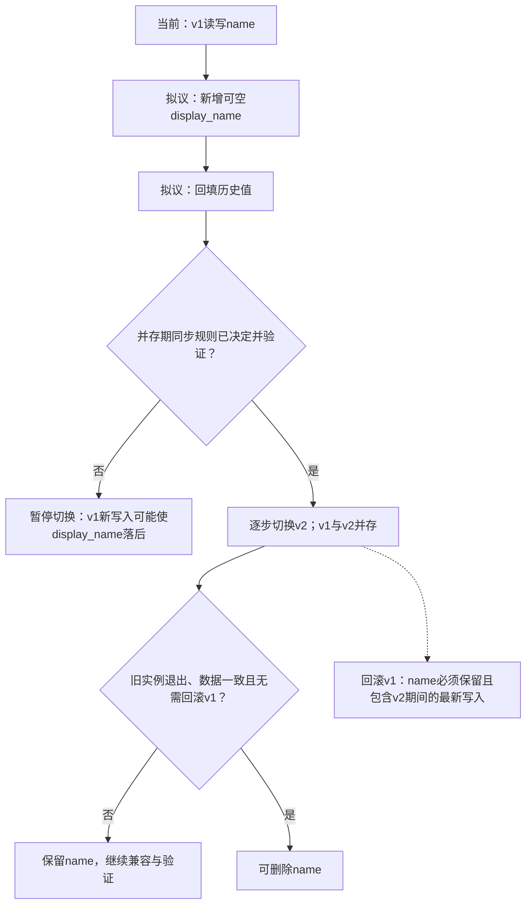

```mermaid
flowchart TD
    A[当前：v1读写name] --> B[拟议：新增可空display_name]
    B --> C[拟议：回填历史值]
    C --> D{并存期同步规则已决定并验证？}
    D -->|否| X[暂停切换：v1新写入可能使display_name落后]
    D -->|是| E[逐步切换v2；v1与v2并存]
    E --> F{旧实例退出、数据一致且无需回滚v1？}
    F -->|否| K[保留name，继续兼容与验证]
    F -->|是| H[可删除name]
    E -.-> R[回滚v1：name必须保留且包含v2期间的最新写入]
```

一次回填不能覆盖并存期v1持续写入。还需决定字段同步、冲突处理、v2遇到空值的行为，并验证并发写入及回滚时的数据一致性；不能假定已有双写。

只有所有依赖name的实例与任务退出、display_name完整且一致、v1回滚窗口关闭后，才能删除name；否则回滚可能读到旧值，删列后v1甚至无法运行。
