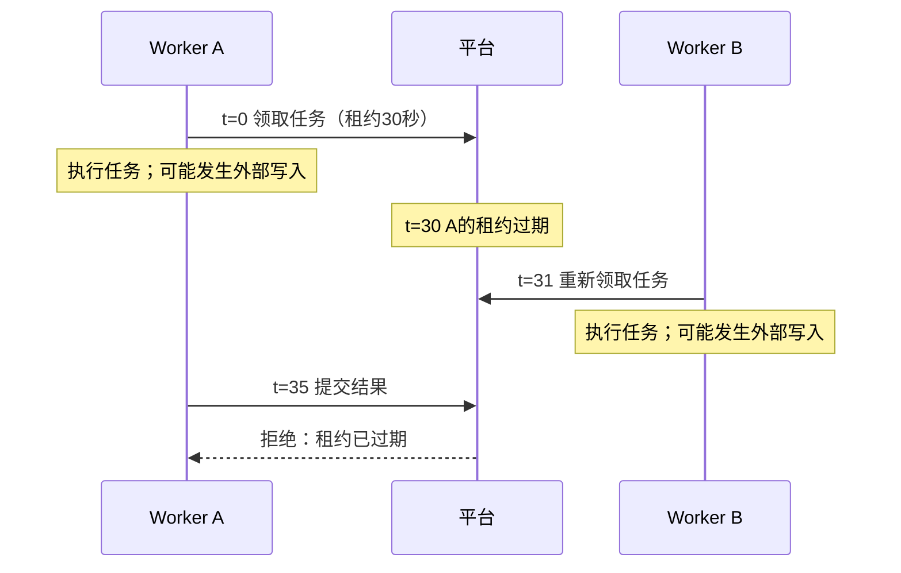

```mermaid
sequenceDiagram
    participant A as Worker A
    participant P as 平台
    participant B as Worker B
    A->>P: t=0 领取任务（租约30秒）
    Note over A: 执行任务；可能发生外部写入
    Note over P: t=30 A的租约过期
    B->>P: t=31 重新领取任务
    Note over B: 执行任务；可能发生外部写入
    A->>P: t=35 提交结果
    P-->>A: 拒绝：租约已过期
```

“任务只执行一次”不成立：租约校验只能拒绝A的过期结果，不能阻止A、B重复执行或重复产生外部副作用。外部写入是否能防重，题目没有保证。
