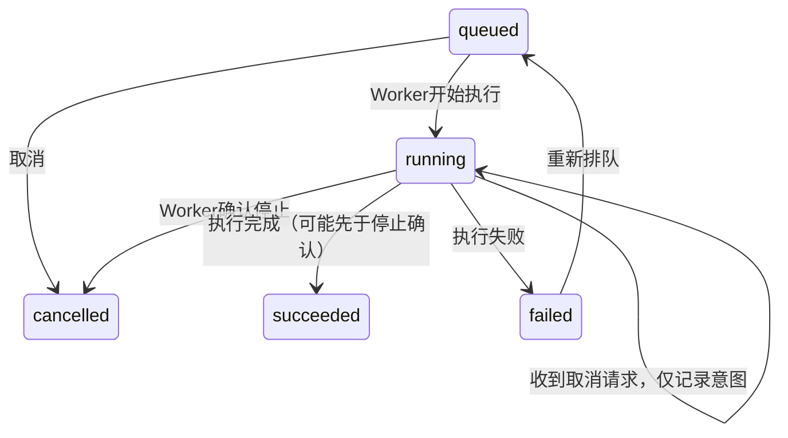

```mermaid
stateDiagram-v2
    queued --> running: Worker开始执行
    queued --> cancelled: 取消
    running --> running: 收到取消请求，仅记录意图
    running --> cancelled: Worker确认停止
    running --> succeeded: 执行完成（可能先于停止确认）
    running --> failed: 执行失败
    failed --> queued: 重新排队
```

取消请求表示“希望停止”，此时仍是running；取消完成需要Worker确认停止，才进入cancelled。若先完成，任务可进入succeeded。succeeded能否重试尚未规定，图中不补这条边。
