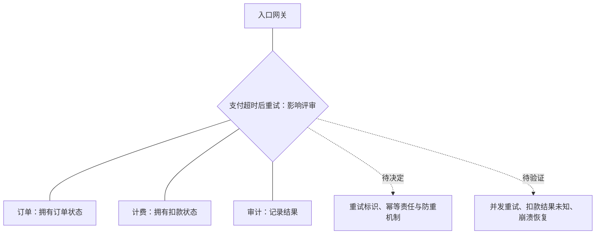

```mermaid
flowchart TB
    G[入口网关] --- R{支付超时后重试：影响评审}
    R --- O[订单：拥有订单状态]
    R --- B[计费：拥有扣款状态]
    R --- A[审计：记录结果]
    R -. 待决定 .-> I[重试标识、幂等责任与防重机制]
    R -. 待验证 .-> V[并发重试、扣款结果未知、崩溃恢复]
```

实线展示影响范围和已知职责，不代表已确认的调用链。

需决定：同一笔支付如何跨重试识别、在哪里保证不重复扣款，订单超时后如何表达未知结果，审计如何关联多次尝试。计费拥有扣款状态，但现有幂等方案尚无资料；防重效果需用并发与故障场景验证。
