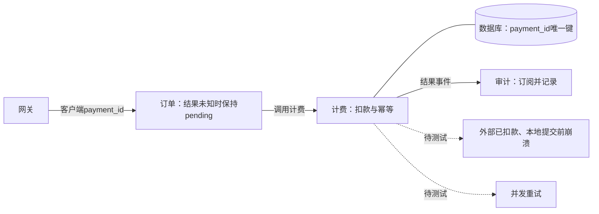

```mermaid
flowchart LR
    G[网关] -->|客户端payment_id| O[订单：结果未知时保持pending]
    O -->|调用计费| B[计费：扣款与幂等]
    B --- D[(数据库：payment_id唯一键)]
    B -->|结果事件| A[审计：订阅并记录]
    B -. 待测试 .-> T[外部已扣款、本地提交前崩溃]
    B -. 待测试 .-> C[并发重试]
```

上述职责与唯一键已确认，本次沿用。需要补齐两类测试：崩溃后重试是否避免再次扣款并恢复结果；并发重试是否只产生一次扣款并返回一致结果。也应核对订单pending能否随结果收敛、审计事件能否对应最终结果。

唯一键已存在，但它对外部扣款故障窗口的保护效果，仍需测试证据。
