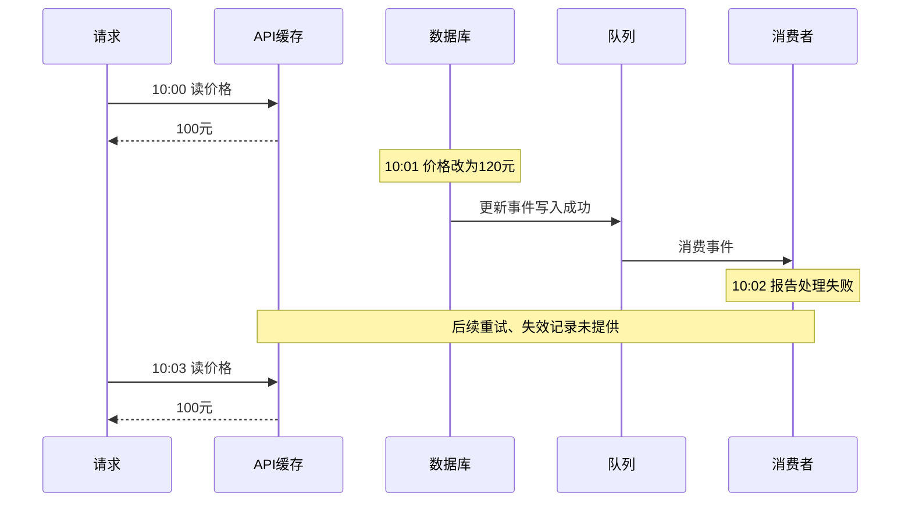

```mermaid
sequenceDiagram
    participant R as 请求
    participant C as API缓存
    participant D as 数据库
    participant Q as 队列
    participant W as 消费者
    R->>C: 10:00 读价格
    C-->>R: 100元
    Note over D: 10:01 价格改为120元
    D->>Q: 更新事件写入成功
    Q->>W: 消费事件
    Note over W: 10:02 报告处理失败
    Note over W,C: 后续重试、失效记录未提供
    R->>C: 10:03 读价格
    C-->>R: 100元
```

候选原因：处理失败可能阻断失效；也可能失效了错误的键或实例，或旧值被再次写入。时间顺序不能证明哪一种发生了。

下一步：按事件ID查失败阶段、重试/死信和失效记录，再核对缓存键、实例、写入时间及实际TTL。TTL为10分钟，但10:00只是命中时间，不能据此推算何时过期。
