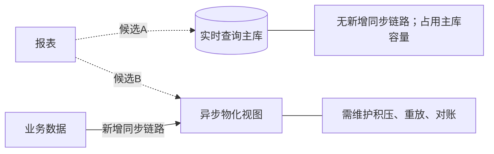

| 比较点 | 实时主库 | 异步物化视图 |
|---|---|---|
| 数据延迟 | 查询当前数据 | 必须控制在5分钟内 |
| 高峰容量 | 主库接近上限，需证明承载能力 | 可分担查询，仍需量化同步开销 |
| 两人维护 | 链路较少 | 额外运维负担需评估 |

有条件地优先验证物化视图：若能满足5分钟延迟且两人能维护，较适合缓解高峰压力。若报表实测开销很小、主库仍有安全余量，实时查询也可成立。

决策前需要：报表成本与高峰负载测试、物化视图积压恢复时间、重放/对账演练及维护成本。两者目前都是候选。
