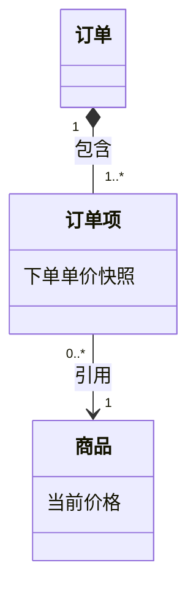

```mermaid
classDiagram
    订单 "1" *-- "1..*" 订单项 : 包含
    订单项 "0..*" --> "1" 商品 : 引用
    class 订单项 {
        下单单价快照
    }
    class 商品 {
        当前价格
    }
```

每个订单至少有一个订单项；每个订单项只属于一个订单，并引用一个商品。一个商品可以被零个或多个订单项引用。

订单项使用下单时的单价快照；商品当前价格变化不能改写历史快照。图表达领域归属与引用，不规定表、外键、级联删除或ORM实现。
