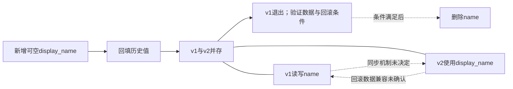

回填只覆盖历史时点：并存期间v1新增或修改name，display_name可能为空或过时；v2更新若未同步回name，回滚到v1也可能读到旧值。

还缺：两字段的权威值、同步方式与冲突规则，v2遇到空值的行为，回填期间并发写入的处理，以及并存和回滚测试。不能假定已有双写。

只有v1及其他name读写方全部退出、数据完整一致、同步迁移验证通过，且不再需要直接回滚到依赖name的版本（或已有验证过的恢复方案），才能删除name。
