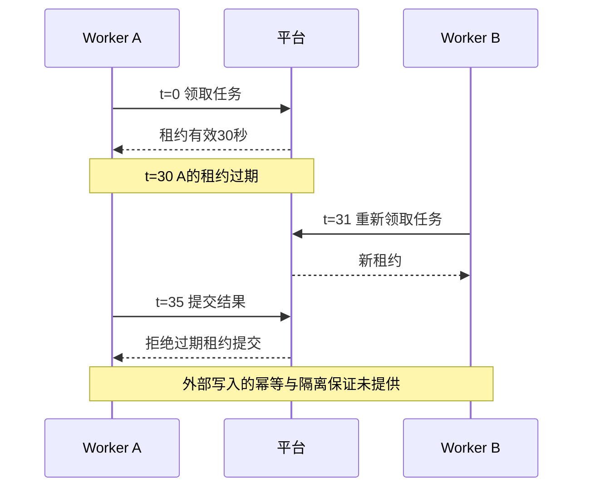

```mermaid
sequenceDiagram
    participant A as Worker A
    participant P as 平台
    participant B as Worker B
    A->>P: t=0 领取任务
    P-->>A: 租约有效30秒
    Note over A,P: t=30 A的租约过期
    B->>P: t=31 重新领取任务
    P-->>B: 新租约
    A->>P: t=35 提交结果
    P-->>A: 拒绝过期租约提交
    Note over A,B: 外部写入的幂等与隔离保证未提供
```

“任务只执行一次”不成立：拒绝A提交只能保护平台结果提交，不能证明A停止执行，也不能撤销其外部写入。A、B可能重复执行并产生重复副作用；需核实外部写入的幂等或隔离机制。B领取也不等于执行完成。

未渲染验证。
