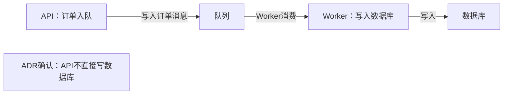

```mermaid
flowchart LR
    A[API：订单入队] -->|写入订单消息| Q[队列]
    Q -->|Worker消费| W[Worker：写入数据库]
    W -->|写入| D[数据库]
    R[ADR确认：API不直接写数据库]
```

事实是上述职责与消息、写入关系，ADR确认了API的写入边界。采用队列是否为了吞吐、故障隔离或其他目标，尚未确认；不能从当前结构倒推设计原因。下一步查原始决策记录及其约束依据。

未渲染验证。
