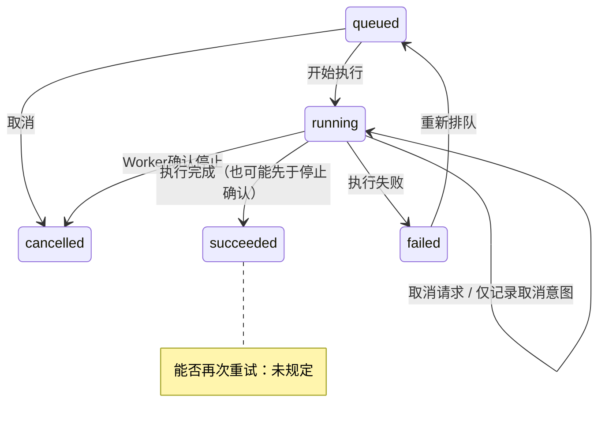

```mermaid
stateDiagram-v2
    queued --> running: 开始执行
    queued --> cancelled: 取消
    running --> running: 取消请求 / 仅记录取消意图
    running --> cancelled: Worker确认停止
    running --> succeeded: 执行完成（也可能先于停止确认）
    running --> failed: 执行失败
    failed --> queued: 重新排队
    note right of succeeded
        能否再次重试：未规定
    end note
```

取消请求表达意图，任务仍是running；Worker确认停止才是取消完成。完成可能抢先发生并进入succeeded，因此请求取消不保证最终cancelled。图未为succeeded补出重试路径，需核实相应规则。

未渲染验证。
